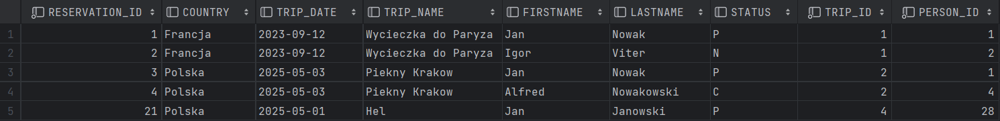
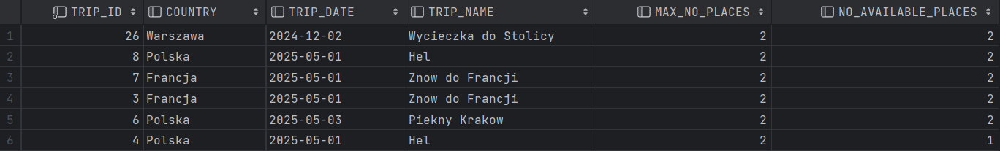
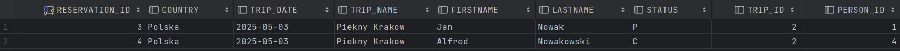
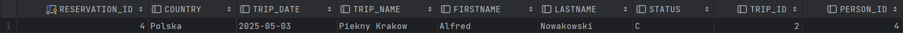
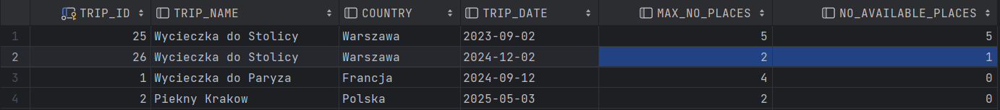

# Oracle PL/Sql

widoki, funkcje, procedury, triggery
ćwiczenie

---


Imiona i nazwiska autorów : Stas Kochevenko & Wiktor Dybalski

---

# Tabele


- `Trip`  - wycieczki
	- `trip_id` - identyfikator, klucz główny
	- `trip_name` - nazwa wycieczki
	- `country` - nazwa kraju
	- `trip_date` - data
	- `max_no_places` -  maksymalna liczba miejsc na wycieczkę
- `Person` - osoby
	- `person_id` - identyfikator, klucz główny
	- `firstname` - imię
	- `lastname` - nazwisko


- `Reservation`  - rezerwacje
	- `reservation_id` - identyfikator, klucz główny
	- `trip_id` - identyfikator wycieczki
	- `person_id` - identyfikator osoby
	- `status` - status rezerwacji
		- `N` – New - Nowa
		- `P` – Confirmed and Paid – Potwierdzona  i zapłacona
		- `C` – Canceled - Anulowana
- `Log` - dziennik zmian statusów rezerwacji 
	- `log_id` - identyfikator, klucz główny
	- `reservation_id` - identyfikator rezerwacji
	- `log_date` - data zmiany
	- `status` - status


```sql
create sequence s_person_seq  
   start with 1  
   increment by 1;

create table person  
(  
  person_id int not null
      constraint pk_person  
         primary key,
  firstname varchar(50),  
  lastname varchar(50)
)  

alter table person  
    modify person_id int default s_person_seq.nextval;
   
```


```sql
create sequence s_trip_seq  
   start with 1  
   increment by 1;

create table trip  
(  
  trip_id int  not null
     constraint pk_trip  
         primary key, 
  trip_name varchar(100),  
  country varchar(50),  
  trip_date date,  
  max_no_places int
);  

alter table trip 
    modify trip_id int default s_trip_seq.nextval;
```


```sql
create sequence s_reservation_seq  
   start with 1  
   increment by 1;

create table reservation  
(  
  reservation_id int not null
      constraint pk_reservation  
         primary key, 
  trip_id int,  
  person_id int,  
  status char(1)
);  

alter table reservation 
    modify reservation_id int default s_reservation_seq.nextval;


alter table reservation  
add constraint reservation_fk1 foreign key  
( person_id ) references person ( person_id ); 
  
alter table reservation  
add constraint reservation_fk2 foreign key  
( trip_id ) references trip ( trip_id );  
  
alter table reservation  
add constraint reservation_chk1 check  
(status in ('N','P','C'));

```


```sql
create sequence s_log_seq  
   start with 1  
   increment by 1;


create table log  
(  
    log_id int not null
         constraint pk_log  
         primary key,
    reservation_id int not null,  
    log_date date not null,  
    status char(1)
);  

alter table log 
    modify log_id int default s_log_seq.nextval;
  
alter table log  
add constraint log_chk1 check  
(status in ('N','P','C')) enable;
  
alter table log  
add constraint log_fk1 foreign key  
( reservation_id ) references reservation ( reservation_id );
```


---
# Dane


Należy wypełnić  tabele przykładowymi danymi 
- 4 wycieczki
- 10 osób
- 10  rezerwacji

Dane testowe powinny być różnorodne (wycieczki w przyszłości, wycieczki w przeszłości, rezerwacje o różnym statusie itp.) tak, żeby umożliwić testowanie napisanych procedur.

W razie potrzeby należy zmodyfikować dane tak żeby przetestować różne przypadki.


```sql
-- trip
insert into trip(trip_name, country, trip_date, max_no_places)  
values ('Wycieczka do Paryza', 'Francja', to_date('2023-09-12', 'YYYY-MM-DD'), 3);  
  
insert into trip(trip_name, country, trip_date,  max_no_places)  
values ('Piekny Krakow', 'Polska', to_date('2025-05-03','YYYY-MM-DD'), 2);  
  
insert into trip(trip_name, country, trip_date,  max_no_places)  
values ('Znow do Francji', 'Francja', to_date('2025-05-01','YYYY-MM-DD'), 2);  
  
insert into trip(trip_name, country, trip_date,  max_no_places)  
values ('Hel', 'Polska', to_date('2025-05-01','YYYY-MM-DD'),  2);

-- person
insert into person(firstname, lastname)  
values ('Jan', 'Nowak');  
  
insert into person(firstname, lastname)  
values ('Jan', 'Kowalski');  
  
insert into person(firstname, lastname)  
values ('Jan', 'Nowakowski');  
  
insert into person(firstname, lastname)  
values  ('Novak', 'Nowak');

-- reservation
-- trip1
insert  into reservation(trip_id, person_id, status)  
values (1, 1, 'P');  
  
insert into reservation(trip_id, person_id, status)  
values (1, 2, 'N');  
  
-- trip 2  
insert into reservation(trip_id, person_id, status)  
values (2, 1, 'P');  
  
insert into reservation(trip_id, person_id, status)  
values (2, 4, 'C');  
  
-- trip 3  
insert into reservation(trip_id, person_id, status)  
values (2, 4, 'P');
```

proszę pamiętać o zatwierdzeniu transakcji

---
# Zadanie 0 - modyfikacja danych, transakcje

Należy przeprowadzić kilka eksperymentów związanych ze wstawianiem, modyfikacją i usuwaniem danych
oraz wykorzystaniem transakcji

Skomentuj dzialanie transakcji. Jak działa polecenie `commit`, `rollback`?.
Co się dzieje w przypadku wystąpienia błędów podczas wykonywania transakcji? Porównaj sposób programowania operacji wykorzystujących transakcje w Oracle PL/SQL ze znanym ci systemem/językiem MS Sqlserver T-SQL

pomocne mogą być materiały dostępne tu:
https://upel.agh.edu.pl/mod/folder/view.php?id=214774
w szczególności dokument: `1_modyf.pdf`


```sql

begin
    insert into log(reservation_id, log_date, status)
    values (5, TO_DATE('2024-06-04','YYYY-MM-DD'), 'P');
    insert into log(reservation_id, log_date, status)
    values (NULL, TO_DATE('2024-06-04','YYYY-MM-DD'), 'P');
    dbms_output.put_line('OK');
end;

```
Spróbujmy przeprowadzić eksperyment. Nie mamy rekordów w tabeli "Log":


Następnie wstawiamy bezbłędne dane:


Wstawienie się udało:


Sprawdzamy usunięcie rekordu:


Usunięcie się udało:


A teraz spróbujmy dodać kolejno prawidłowe, a następnie nieprawidłowe dane (resrevation_id nie może być NULL):


Widzimy error:


W wyniku tego polecenia żaden wiersz nie został dodany:


Możemy zauważyć, że w języku PL/SQL jeśli mamy na przykład operacje dodawania 2 wierszy w jednym bloku "BEGIN-END", to w przypadku, gdy 2-ie polecenie kończy się błędem i nie obsługujemy tego błędu, żaden wiersz nie zostanie dodany, na zewnątrz zostanie wyrzucony wyjątek. 

Natomiast jeżelibyśmy wykonali to samo w języku Transact-SQL wewnątrz "BEGIN TRAN-COMMIT TRAN", pierwszy wiersz zostałby dodany do bazy, bo mimo że 2-ie polecenie kończy się błędem, to nie jest to błąd krytyczny. Aby osiągnąć taki efekt, żeby cała sekwencja została wycofana w przypadku takiego błędu w języku Transact-SQL, możemy skorzystać z "TRY-CATCH", i w bloku "CATCH" wykonać "rollback tran".

W przypadku, gdy obsłużymy wyjątek spowodowany 2-im poleceniem w języku PL/SQL i nie wyrzucimy "raise", to będziemy mieli 2 sytuacje: jeśli jesteśmy w trybie Auto-Commit, to ten poprawny wiersz zostanie dopisany do bazy, a jeśli jesteśmy w trybie Manual, to mamy jeszcze możliwość wykonania polecenia "rollback".

Oprócz tego, w języku PL/SQL nie mamy transakcji zagnieżdżonych.

---
# Zadanie 1 - widoki


Tworzenie widoków. Należy przygotować kilka widoków ułatwiających dostęp do danych. Należy zwrócić uwagę na strukturę kodu (należy unikać powielania kodu)

Widoki:
-   `vw_reservation`
	- widok łączy dane z tabel: `trip`,  `person`,  `reservation`
	- zwracane dane:  `reservation_id`,  `country`, `trip_date`, `trip_name`, `firstname`, `lastname`, `status`, `trip_id`, `person_id`
- `vw_trip` 
	- widok pokazuje liczbę wolnych miejsc na każdą wycieczkę
	- zwracane dane: `trip_id`, `country`, `trip_date`, `trip_name`, `max_no_places`, `no_available_places` (liczba wolnych miejsc)
-  `vw_available_trip`
	- podobnie jak w poprzednim punkcie, z tym że widok pokazuje jedynie dostępne wycieczki (takie które są w przyszłości i są na nie wolne miejsca)


Proponowany zestaw widoków można rozbudować wedle uznania/potrzeb
- np. można dodać nowe/pomocnicze widoki
- np. można zmienić def. widoków, dodając nowe/potrzebne pola

# Zadanie 1  - rozwiązanie

- vw_reservation

```sql 
create or replace view VW_RESERVATION as
SELECT  reservation_id, country, trip_date, trip_name, firstname, lastname, status, t.trip_id, p.person_id
FROM RESERVATION r
INNER JOIN person p on r.PERSON_ID = p.PERSON_ID
INNER JOIN trip t on r.TRIP_ID = t.TRIP_ID
```



- vw_trip

```sql
create or replace view VW_TRIP as
SELECT  t.trip_id, country, trip_date, trip_name, max_no_places,
        CASE
            WHEN (t.max_no_places - NVL(COUNT(r.trip_id), 0)) < 0 THEN 0
            ELSE (t.max_no_places - NVL(COUNT(r.trip_id), 0))
        END AS no_available_places
FROM TRIP t
LEFT JOIN (SELECT * FROM RESERVATION WHERE STATUS != 'C') r on t.TRIP_ID = r.TRIP_ID
GROUP BY t.trip_id, t.country, t.trip_date, t.trip_name, t.max_no_places
```


- vw_available_trip

```sql
create or replace view VW_AVAILABLE_TRIP as
SELECT * FROM VW_TRIP
    WHERE TRIP_DATE > SYSDATE AND NO_AVAILABLE_PLACES > 0;
```




---
# Zadanie 2  - funkcje


Tworzenie funkcji pobierających dane/tabele. Podobnie jak w poprzednim przykładzie należy przygotować kilka funkcji ułatwiających dostęp do danych

Funkcje:
- `f_trip_participants`
	- zadaniem funkcji jest zwrócenie listy uczestników wskazanej wycieczki
	- parametry funkcji: `trip_id`
	- funkcja zwraca podobny zestaw danych jak widok  `vw_reservation`
-  `f_person_reservations`
	- zadaniem funkcji jest zwrócenie listy rezerwacji danej osoby 
	- parametry funkcji: `person_id`
	- funkcja zwraca podobny zestaw danych jak widok `vw_reservation`
-  `f_available_trips_to`
	- zadaniem funkcji jest zwrócenie listy wycieczek do wskazanego kraju, dostępnych w zadanym okresie czasu (od `date_from` do `date_to`)
	- parametry funkcji: `country`, `date_from`, `date_to`


Funkcje powinny zwracać tabelę/zbiór wynikowy. Należy rozważyć dodanie kontroli parametrów, (np. jeśli parametrem jest `trip_id` to można sprawdzić czy taka wycieczka istnieje). Podobnie jak w przypadku widoków należy zwrócić uwagę na strukturę kodu

Czy kontrola parametrów w przypadku funkcji ma sens?
- jakie są zalety/wady takiego rozwiązania?

Proponowany zestaw funkcji można rozbudować wedle uznania/potrzeb
- np. można dodać nowe/pomocnicze funkcje/procedury

# Zadanie 2  - rozwiązanie

Mimo tego, że funkcje mogą zwracać tabele, jak widoki albo polecenie "select", kontrola parametrów w przypadku funkcji ma sens. W ten sposób możemy na przykład odróżnić dwie sytuacje: gdy dane o takim parametrze nie istnieją i gdy dane o takim parametrze istnieją, ale są nie zgodne z warunkiem funkcji.

Wadą takiego rozwiązania może być dość duży, czasem nieczytelny kod, a więc jest kilka sposobów na uproszczenie tej funkcji, na przykład przez zdefiniowanie funkcji pomocniczej.

- f_trip_exist (pomocnicza)

```sql
create or replace function f_trip_exist(trip int)
    return boolean
as
    exist number;
begin
    select case
            when exists(select * from TRIP where TRIP.TRIP_ID = trip) then 1
            else 0
           end
    into exist from dual;

    if exist = 1 then
        return true;
    else
        return false;
    end if;
end;
```

- f_person_exist (pomocnicza)

```sql
create or replace function f_person_exist(person int)
    return boolean
as
    exist number;
begin
    select case
            when exists(select * from PERSON where PERSON.PERSON_ID = person) then 1
            else 0
           end
    into exist from dual;

    if exist = 1 then
        return true;
    else
        return false;
    end if;
end;
```

- f_reservation_exist (pomocnicza)

```sql
create or replace function f_reservation_exist(reservation int)
    return boolean
as
    exist number;
begin
    select case
            when exists(select * from RESERVATION where RESERVATION.RESERVATION_ID = reservation) then 1
            else 0
           end
    into exist from dual;

    if exist = 1 then
        return true;
    else
        return false;
    end if;
end;
```

- f_trip_is_available (pomocnicza)

```sql
create or replace function f_trip_is_available(trip int)
    return boolean
as
    exist number;
begin
    select case
            when exists(select * from VW_AVAILABLE_TRIP AV where AV.TRIP_ID = trip) then 1
            else 0
           end
    into exist from dual;

    if exist = 1 then
        return true;
    else
        return false;
    end if;
end;
```

- f_trip_participants

```sql
CREATE OR REPLACE TYPE ob_trip_participants AS OBJECT (
    reservation_id INT,
    country varchar(50),
    trip_date date,
    trip_name varchar(100),
    firstname VARCHAR2(50),
    lastname VARCHAR2(50),
    status CHAR(1),
    trip_id int,
    person_id int
);

create or replace type tab_trip_participants is table of ob_trip_participants;

create or replace function f_trip_participants(trip_id int)
    return tab_trip_participants
as
    result tab_trip_participants;
begin
    if not f_trip_exist(trip_id) then
        raise_application_error(-20001, 'trip not found');
    end if;

    select ob_trip_participants(vw_r.RESERVATION_ID, vw_r.COUNTRY, vw_r.TRIP_DATE, vw_r.TRIP_NAME, vw_r.FIRSTNAME, vw_r.LASTNAME, vw_r.STATUS, vw_r.TRIP_ID, vw_r.PERSON_ID)
    bulk collect
    into result
    from vw_reservation vw_r
    where vw_r.TRIP_ID = f_trip_participants.trip_id;

    return result;
end;
```

Przykład dla trip_id = 2:



- f_person_reservations

```sql
create or replace function f_person_reservations(person_id int)
    return tab_trip_participants
as
    result tab_trip_participants;
begin
    if not f_person_exist(person_id) then
        raise_application_error(-20001, 'person not found');
    end if;
    select ob_trip_participants(vw_r.RESERVATION_ID, vw_r.COUNTRY, vw_r.TRIP_DATE, vw_r.TRIP_NAME, vw_r.FIRSTNAME, vw_r.LASTNAME, vw_r.STATUS, vw_r.TRIP_ID, vw_r.PERSON_ID)
    bulk collect
    into result
    from vw_reservation vw_r
    where vw_r.PERSON_ID = f_person_reservations.person_id;

    return result;
end;
```

Przykład dla person_id = 4:



- f_available_trips_to

```sql

CREATE OR REPLACE TYPE ob_trip AS OBJECT (
    trip_id int,
    country varchar(50),
    trip_date date,
    trip_name varchar(100),
    max_no_places int,
    no_available_places int
);

create or replace type tab_trip is table of ob_trip;

create or replace function f_available_trips_to(country trip.country%TYPE, date_from date, date_to date)
    return tab_trip
as
    result tab_trip;
begin
    if date_from > date_to then
        raise_application_error(-20001, 'incorrect date of trip');
    end if;

    select ob_trip(vw_av.TRIP_ID, vw_av.COUNTRY, vw_av.TRIP_DATE, vw_av.TRIP_NAME, vw_av.MAX_NO_PLACES, vw_av.NO_AVAILABLE_PLACES)
    bulk collect
    into result
    from vw_available_trip vw_av
    where vw_av.COUNTRY = f_available_trips_to.country and vw_av.TRIP_DATE between date_from and date_to;

    return result;
end;

```
Przykład dla country = 'Francja':


---
# Zadanie 3  - procedury


Tworzenie procedur modyfikujących dane. Należy przygotować zestaw procedur pozwalających na modyfikację danych oraz kontrolę poprawności ich wprowadzania


Procedury:
- `p_add_reservation`
	- zadaniem procedury jest dopisanie nowej rezerwacji
	- parametry: `trip_id`, `person_id`, 
	- procedura powinna kontrolować czy wycieczka jeszcze się nie odbyła, i czy sa wolne miejsca
	- procedura powinna również dopisywać inf. do tabeli `log`
- `p_modify_reservation_status`
	- zadaniem procedury jest zmiana statusu rezerwacji 
	- parametry: `reservation_id`, `status` 
	- procedura powinna kontrolować czy możliwa jest zmiana statusu, np. zmiana statusu już anulowanej wycieczki (przywrócenie do stanu aktywnego nie zawsze jest możliwa – może już nie być miejsc)
	- procedura powinna również dopisywać inf. do tabeli `log`
- `p_modify_max_no_places`
	- zadaniem procedury jest zmiana maksymalnej liczby miejsc na daną wycieczkę 
	- parametry: `trip_id`, `max_no_places`
	- nie wszystkie zmiany liczby miejsc są dozwolone, nie można zmniejszyć liczby miejsc na wartość poniżej liczby zarezerwowanych miejsc

Należy rozważyć użycie transakcji

Należy zwrócić uwagę na kontrolę parametrów (np. jeśli parametrem jest trip_id to należy sprawdzić czy taka wycieczka istnieje, jeśli robimy rezerwację to należy sprawdzać czy są wolne miejsca itp..)


Proponowany zestaw procedur można rozbudować wedle uznania/potrzeb
- np. można dodać nowe/pomocnicze funkcje/procedury

# Zadanie 3  - rozwiązanie

- p_add_reservation

```sql
create or replace PROCEDURE p_add_reservation(
    p_trip_id trip.trip_id%TYPE,
    p_person_id person.person_id%TYPE
)
AS
    v_trip_date trip.TRIP_DATE%TYPE;
    v_reservation_count NUMBER;
    v_reservation_id RESERVATION.RESERVATION_ID%TYPE;

BEGIN
--  Validating
    IF not f_trip_exist(p_trip_id) then
        raise_application_error(-20000, 'Trip not found!');
    end if;

    IF not f_person_exist(p_person_id) then
        raise_application_error(-20001, 'Person not found!');
    end if;

    SELECT TRIP_DATE INTO v_trip_date FROM TRIP WHERE TRIP_ID = p_trip_id;

    IF v_trip_date <= SYSDATE THEN
        RAISE_APPLICATION_ERROR(-20002, 'The trip has already taken place!');
    END IF;

    IF not f_trip_is_available(p_trip_id) then
        raise_application_error(-20003, 'There are no available places on this trip!');
    end if;

	SELECT COUNT(*) INTO v_reservation_count
    FROM RESERVATION
    WHERE TRIP_ID = p_trip_id AND PERSON_ID = p_person_id;

    IF v_reservation_count > 0 THEN
        RAISE_APPLICATION_ERROR(-20005, 'This person already has a reservation for this trip!');
    END IF;

--  Add reservation
    INSERT INTO RESERVATION (TRIP_ID, PERSON_ID, STATUS)
    VALUES (p_trip_id, p_person_id, 'N')
    RETURNING RESERVATION_ID INTO v_reservation_id;

    IF v_reservation_id IS NULL THEN
        RAISE_APPLICATION_ERROR(-20004, 'Failed to get reservation_id!');
    END IF;

    INSERT INTO LOG (RESERVATION_ID, LOG_DATE, STATUS)
    VALUES  (v_reservation_id, SYSDATE, 'N');

    COMMIT;
    DBMS_OUTPUT.PUT_LINE('Reservation added successfully!');
END;
```
Przykładowe wywołania:

Error: Wycieczka odbyła się:


Error: Brak miejsc na wycieczce:


Error: Nie można przypisać więcej niż 1 rezerwacji na jedną osobę:


- p_modify_reservation_status

```sql
CREATE OR REPLACE PROCEDURE p_modify_reservation_status (
    p_reservation_id reservation.reservation_id%TYPE,
    p_status reservation.STATUS%TYPE
)
AS
    v_current_status CHAR;
    v_trip_date DATE;
    v_exists INTEGER;
BEGIN
    IF not f_reservation_exist(p_reservation_id) then
        raise_application_error(-20000, 'Reservation not found!');
    end if;

    IF p_status NOT in ('N', 'P', 'C') then
        RAISE_APPLICATION_ERROR(-20005, 'Status is not correct! Give one of the values "N", "P", "C"');
    END IF;

    SELECT STATUS INTO v_current_status FROM RESERVATION
    WHERE RESERVATION_ID = p_reservation_id;

    IF p_status = 'C' THEN
        SELECT TRIP_DATE INTO v_trip_date FROM TRIP
        WHERE TRIP_ID = (SELECT TRIP_ID FROM RESERVATION WHERE RESERVATION_ID = p_reservation_id);

        IF v_trip_date <= SYSDATE THEN
            RAISE_APPLICATION_ERROR(-20006, 'Cannot cancel reservation for past trip!');
        END IF;
    END IF;

    IF v_current_status = 'C' THEN
        SELECT COUNT(*) INTO v_exists
        FROM VW_AVAILABLE_TRIP
        WHERE TRIP_ID = (SELECT TRIP_ID FROM RESERVATION WHERE RESERVATION_ID = p_reservation_id);

        IF v_exists = 0 THEN
            RAISE_APPLICATION_ERROR(-20007, 'Cannot create reservation, no available places on trip!');
        END IF;
    END IF;

    UPDATE RESERVATION SET STATUS = p_status
    WHERE RESERVATION_ID = p_reservation_id;

    INSERT INTO LOG (RESERVATION_ID, LOG_DATE, STATUS)
    VALUES  (p_reservation_id, SYSDATE, p_status);

    COMMIT;
    DBMS_OUTPUT.PUT_LINE('Reservation status modified successfully!');
END;
```

Przykładowe wywołania:


- p_modify_max_no_places

```sql
CREATE OR REPLACE PROCEDURE p_modify_max_no_places (
    p_trip_id trip.trip_id%TYPE,
    p_max_no_places trip.max_no_places%TYPE
)
AS
    v_current_max_no_places trip.max_no_places%TYPE;
    v_no_available trip.max_no_places%TYPE;
BEGIN
    IF not f_trip_exist(p_trip_id) then
        raise_application_error(-20006, 'Trip not found!');
    end if;

    SELECT MAX_NO_PLACES INTO v_current_max_no_places FROM TRIP
    WHERE TRIP_ID = p_trip_id;

    if v_current_max_no_places <= 0 then
        raise_application_error(-20007, 'This number is smaller than 0!');
    end if;

    SELECT NO_AVAILABLE_PLACES INTO v_no_available FROM VW_TRIP
    WHERE TRIP_ID = p_trip_id;

    if p_max_no_places < v_current_max_no_places - v_no_available then
        raise_application_error(-20008, 'This number is smaller than the number of reserved places!');
    end if;

    UPDATE TRIP SET MAX_NO_PLACES = p_max_no_places
    WHERE TRIP_ID = p_trip_id;

    COMMIT;
    DBMS_OUTPUT.PUT_LINE('Max number of places modified successfully!');
END;
```

Przykładowe wywołania:


Zmiany w tabeli Log po kilku operacjach:


---
# Zadanie 4  - triggery


Zmiana strategii zapisywania do dziennika rezerwacji. Realizacja przy pomocy triggerów

Należy wprowadzić zmianę, która spowoduje, że zapis do dziennika rezerwacji będzie realizowany przy pomocy trierów

Triggery:
- trigger/triggery obsługujące 
	- dodanie rezerwacji
	- zmianę statusu
- trigger zabraniający usunięcia rezerwacji

Oczywiście po wprowadzeniu tej zmiany należy "uaktualnić" procedury modyfikujące dane. 

>UWAGA
Należy stworzyć nowe wersje tych procedur (dodając do nazwy dopisek 4 - od numeru zadania). Poprzednie wersje procedur należy pozostawić w celu  umożliwienia weryfikacji ich poprawności

Należy przygotować procedury: `p_add_reservation_4`, `p_modify_reservation_status_4` 


# Zadanie 4  - rozwiązanie

- trg_insert_log_reservation

```sql
CREATE OR REPLACE TRIGGER trg_insert_log_reservation
AFTER INSERT ON RESERVATION
FOR EACH ROW
BEGIN
    INSERT INTO LOG (RESERVATION_ID, LOG_DATE, STATUS)
    VALUES (:new.reservation_id, SYSDATE, :new.status);
END;
```

- p_add_reservation_4

```sql
create or replace PROCEDURE p_add_reservation_4(
    p_trip_id trip.trip_id%TYPE,
    p_person_id person.person_id%TYPE
)
AS
    v_trip_date trip.TRIP_DATE%TYPE;

BEGIN
--  Validating
    IF not f_trip_exist(p_trip_id) then
        raise_application_error(-20000, 'Trip not found!');
    end if;

    IF not f_person_exist(p_person_id) then
        raise_application_error(-20001, 'Person not found!');
    end if;

    SELECT TRIP_DATE INTO v_trip_date FROM TRIP WHERE TRIP_ID = p_trip_id;

    IF v_trip_date <= SYSDATE THEN
        RAISE_APPLICATION_ERROR(-20002, 'The trip has already taken place!');
    END IF;

    IF not f_trip_is_available(p_trip_id) then
        raise_application_error(-20003, 'There are no available places on this trip!');
    end if;

--  Add reservation
    INSERT INTO RESERVATION (TRIP_ID, PERSON_ID, STATUS)
    VALUES (p_trip_id, p_person_id, 'N');

    COMMIT;
    DBMS_OUTPUT.PUT_LINE('Reservation added successfully!');
END;
```

- trg_modify_reservation_status

```sql
CREATE OR REPLACE TRIGGER trg_modify_reservation_status
AFTER UPDATE OF status ON RESERVATION
FOR EACH ROW
BEGIN
    IF :new.STATUS != :old.STATUS THEN
        INSERT INTO LOG (RESERVATION_ID, LOG_DATE, STATUS)
        VALUES (:new.RESERVATION_ID, SYSDATE, :new.STATUS);
    END IF;
END;
```

- p_modify_reservation_status_4

```sql
CREATE OR REPLACE PROCEDURE p_modify_reservation_status_4 (
    p_reservation_id reservation.reservation_id%TYPE,
    p_status reservation.STATUS%TYPE
)
AS
    v_current_status CHAR;
    v_trip_date DATE;
    v_exists INTEGER;
BEGIN
    IF not f_reservation_exist(p_reservation_id) then
        raise_application_error(-20000, 'Reservation not found!');
    end if;

    IF p_status NOT in ('N', 'P', 'C') then
        RAISE_APPLICATION_ERROR(-20005, 'Status is not correct! Give one of the values "N", "P", "C"');
    END IF;

    SELECT STATUS INTO v_current_status FROM RESERVATION
    WHERE RESERVATION_ID = p_reservation_id;

    IF p_status = 'C' THEN
        SELECT TRIP_DATE INTO v_trip_date FROM TRIP
        WHERE TRIP_ID = (SELECT TRIP_ID FROM RESERVATION WHERE RESERVATION_ID = p_reservation_id);

        IF v_trip_date <= SYSDATE THEN
            RAISE_APPLICATION_ERROR(-20006, 'Cannot cancel reservation for past trip!');
        END IF;
    END IF;

    IF v_current_status = 'C' THEN
        SELECT COUNT(*) INTO v_exists
        FROM VW_AVAILABLE_TRIP
        WHERE TRIP_ID = (SELECT TRIP_ID FROM RESERVATION WHERE RESERVATION_ID = p_reservation_id);

        IF v_exists = 0 THEN
            RAISE_APPLICATION_ERROR(-20007, 'Cannot create reservation, no available places on trip!');
        END IF;
    END IF;

    UPDATE RESERVATION SET STATUS = p_status
    WHERE RESERVATION_ID = p_reservation_id;

    COMMIT;
    DBMS_OUTPUT.PUT_LINE('Reservation status modified successfully!');
END;

```
Dwa powyższe triggery są proste w interpretacji i nie wymagają pokazywania przykładów, efekt końcowy nie różni się od pokazanych w poprzednim rozdziale efektów.

- trg_forbid_reservation_deletion

```sql
CREATE OR REPLACE TRIGGER trg_forbid_reservation_deletion
BEFORE DELETE ON RESERVATION
FOR EACH ROW
BEGIN
    RAISE_APPLICATION_ERROR(-20001, 'Deleting rows from RESERVATION table is not allowed. You can only cancel the reservation');
END;
```

Przykładowe wywołanie:


---
# Zadanie 5  - triggery


Zmiana strategii kontroli dostępności miejsc. Realizacja przy pomocy triggerów

Należy wprowadzić zmianę, która spowoduje, że kontrola dostępności miejsc na wycieczki (przy dodawaniu nowej rezerwacji, zmianie statusu) będzie realizowana przy pomocy trigerów

Triggery:
- Trigger/triggery obsługujące: 
	- dodanie rezerwacji
	- zmianę statusu

Oczywiście po wprowadzeniu tej zmiany należy "uaktualnić" procedury modyfikujące dane. 

>UWAGA
Należy stworzyć nowe wersje tych procedur (np. dodając do nazwy dopisek 5 - od numeru zadania). Poprzednie wersje procedur należy pozostawić w celu  umożliwienia weryfikacji ich poprawności. 

Należy przygotować procedury: `p_add_reservation_5`, `p_modify_reservation_status_5`


# Zadanie 5  - rozwiązanie

- trg_add_reservation

```sql
CREATE OR REPLACE TRIGGER trg_add_reservation
BEFORE INSERT ON RESERVATION
FOR EACH ROW
BEGIN
    IF not f_trip_is_available(:new.trip_id) then
        raise_application_error(-20003, 'There are no available places on this trip!');
    END IF;
END;
```

- p_add_reservation_5

```sql
create or replace PROCEDURE p_add_reservation_5(
    p_trip_id trip.trip_id%TYPE,
    p_person_id person.person_id%TYPE
)
AS
    v_trip_date trip.TRIP_DATE%TYPE;

BEGIN
--  Validating
    IF not f_trip_exist(p_trip_id) then
        raise_application_error(-20000, 'Trip not found!');
    end if;

    IF not f_person_exist(p_person_id) then
        raise_application_error(-20001, 'Person not found!');
    end if;

    SELECT TRIP_DATE INTO v_trip_date FROM TRIP WHERE TRIP_ID = p_trip_id;

    IF v_trip_date <= SYSDATE THEN
        RAISE_APPLICATION_ERROR(-20002, 'The trip has already taken place!');
    END IF;

--  Add reservation
    INSERT INTO RESERVATION (TRIP_ID, PERSON_ID, STATUS)
    VALUES (p_trip_id, p_person_id, 'N');

    COMMIT;
    DBMS_OUTPUT.PUT_LINE('Reservation added successfully!');
END;
```

- trg_modify_reservation_status

```sql
CREATE OR REPLACE TRIGGER trg_modify_reservation_status
BEFORE UPDATE OF status ON RESERVATION
FOR EACH ROW
DECLARE
    PRAGMA AUTONOMOUS_TRANSACTION;
BEGIN
    IF :new.STATUS != 'C' THEN
        IF NOT f_trip_is_available(:new.TRIP_ID) THEN
            RAISE_APPLICATION_ERROR(-20007, 'Cannot create reservation, no available places on trip!');
        END IF;
    END IF;
END;
```

- p_modify_reservation_status_5

```sql
CREATE OR REPLACE PROCEDURE p_modify_reservation_status_5 (
    p_reservation_id reservation.reservation_id%TYPE,
    p_status reservation.STATUS%TYPE
)
AS
    v_current_status CHAR;
    v_trip_date DATE;
BEGIN
    IF not f_reservation_exist(p_reservation_id) then
        raise_application_error(-20000, 'Reservation not found!');
    end if;

    IF p_status NOT in ('N', 'P', 'C') then
        RAISE_APPLICATION_ERROR(-20005, 'Status is not correct! Give one of the values "N", "P", "C"');
    END IF;

    SELECT STATUS INTO v_current_status FROM RESERVATION
    WHERE RESERVATION_ID = p_reservation_id;

    IF p_status = 'C' THEN
        SELECT TRIP_DATE INTO v_trip_date FROM TRIP
        WHERE TRIP_ID = (SELECT TRIP_ID FROM RESERVATION WHERE RESERVATION_ID = p_reservation_id);

        IF v_trip_date <= SYSDATE THEN
            RAISE_APPLICATION_ERROR(-20006, 'Cannot cancel reservation for past trip!');
        END IF;
    END IF;

    UPDATE RESERVATION SET STATUS = p_status
    WHERE RESERVATION_ID = p_reservation_id;

    COMMIT;
    DBMS_OUTPUT.PUT_LINE('Reservation status modified successfully!');
END;
```

Dwa powyższe triggery są proste w interpretacji i nie wymagają pokazywania przykładów, efekt końcowy nie różni się od pokazanych w poprzednich rozdzialach efektów.

Triger, modyfikujący status rezerwacji korzysta z "PRAGMA AUTONOMOUS_TRANSACTION", dzięki czemu tworzy się nowa transakcja, niezależna od tej zewnętrznej i mamy możliwość sprawdzenia wyników funkcji, która korzysta z tabeli, która jest w trakcie modyfikowania. 

Oprócz tego, skrócił się kod, ponieważ w tym triggerze mamy dostęp do nowo wstawianych danych, i jesteśmy w stanie dowiedzieć się jakie jest "trip_id", nie potrzebujemy komplikować kodu, jak w przypadku poprzednich zadań.

---
# Zadanie 6


Zmiana struktury bazy danych. W tabeli `trip`  należy dodać  redundantne pole `no_available_places`.  Dodanie redundantnego pola uprości kontrolę dostępnych miejsc, ale nieco skomplikuje procedury dodawania rezerwacji, zmiany statusu czy też zmiany maksymalnej liczby miejsc na wycieczki.

Należy przygotować polecenie/procedurę przeliczającą wartość pola `no_available_places` dla wszystkich wycieczek (do jednorazowego wykonania)

Obsługę pola `no_available_places` można zrealizować przy pomocy procedur lub triggerów

Należy zwrócić uwagę na spójność rozwiązania.

>UWAGA
Należy stworzyć nowe wersje tych widoków/procedur/triggerów (np. dodając do nazwy dopisek 6 - od numeru zadania). Poprzednie wersje procedur należy pozostawić w celu  umożliwienia weryfikacji ich poprawności. 


- zmiana struktury tabeli

```sql
alter table trip add  
    no_available_places int null
```

- polecenie przeliczające wartość `no_available_places`
	- należy wykonać operację "przeliczenia"  liczby wolnych miejsc i aktualizacji pola  `no_available_places`

# Zadanie 6  - rozwiązanie

- p_update_no_available_places

```sql
CREATE OR REPLACE PROCEDURE p_update_no_available_places (
    p_trip_id trip.trip_id%TYPE
)
AS
    p_no_available_places trip.no_available_places%TYPE;
BEGIN
    IF not f_trip_exist(p_trip_id) then
        raise_application_error(-20000, 'Trip not found!');
    end if;

    SELECT t.MAX_NO_PLACES - NVL(COUNT(r.TRIP_ID), 0)
    INTO p_no_available_places
    FROM TRIP t
    LEFT JOIN RESERVATION r on STATUS != 'C' and r.TRIP_ID = t.TRIP_ID
    where t.TRIP_ID = p_trip_id
    GROUP BY t.trip_ID, t.MAX_NO_PLACES;

    IF p_no_available_places < 0 THEN
        p_no_available_places := 0;
    end if;

    UPDATE TRIP SET NO_AVAILABLE_PLACES = p_no_available_places
    WHERE TRIP_ID = p_trip_id;

    COMMIT;
    DBMS_OUTPUT.PUT_LINE('Number of available places modified successfully!');
END;
```

- p_update_all_no_available_places

```sql
CREATE OR REPLACE PROCEDURE p_update_all_no_available_places
AS
BEGIN
    FOR rec in (select * from trip) LOOP
        p_update_no_available_places(rec.TRIP_ID);
    end loop;

    COMMIT;
    DBMS_OUTPUT.PUT_LINE('All trips number of available places modified successfully!');
END;
```

Przykładowe wywołanie (przed wywołaniem / po wywołaniu):


---
# Zadanie 6a  - procedury


Obsługę pola `no_available_places` należy zrealizować przy pomocy procedur
- procedura dodająca rezerwację powinna aktualizować pole `no_available_places` w tabeli trip
- podobnie procedury odpowiedzialne za zmianę statusu oraz zmianę maksymalnej liczby miejsc na wycieczkę
- należy przygotować procedury oraz jeśli jest to potrzebne, zaktualizować triggery oraz widoki


>UWAGA
Należy stworzyć nowe wersje tych widoków/procedur/triggerów (np. dodając do nazwy dopisek 6a - od numeru zadania). Poprzednie wersje procedur należy pozostawić w celu  umożliwienia weryfikacji ich poprawności. 
- może  być potrzebne wyłączenie 'poprzednich wersji' triggerów 


# Zadanie 6a  - rozwiązanie

- p_add_reservation_6a

```sql
create or replace PROCEDURE p_add_reservation_6a(
    p_trip_id trip.trip_id%TYPE,
    p_person_id person.person_id%TYPE
)
AS
    v_trip_date trip.TRIP_DATE%TYPE;
    v_reservation_count NUMBER;
BEGIN
--  Validating
    IF not f_trip_exist(p_trip_id) then
        raise_application_error(-20000, 'Trip not found!');
    end if;

    IF not f_person_exist(p_person_id) then
        raise_application_error(-20001, 'Person not found!');
    end if;

    SELECT TRIP_DATE INTO v_trip_date FROM TRIP WHERE TRIP_ID = p_trip_id;

    IF v_trip_date <= SYSDATE THEN
        RAISE_APPLICATION_ERROR(-20002, 'The trip has already taken place!');
    END IF;
    
    SELECT COUNT(*) INTO v_reservation_count
    FROM RESERVATION
    WHERE TRIP_ID = p_trip_id AND PERSON_ID = p_person_id;

    IF v_reservation_count > 0 THEN
        RAISE_APPLICATION_ERROR(-20005, 'This person already has a reservation for this trip!');
    END IF;

--  Add reservation
    INSERT INTO RESERVATION (TRIP_ID, PERSON_ID, STATUS)
    VALUES (p_trip_id, p_person_id, 'N');

    BEGIN
        p_update_no_available_places(p_trip_id);
    END;

    COMMIT;
    DBMS_OUTPUT.PUT_LINE('Reservation added successfully!');
END;
```

Przykładowe wywołanie:


- p_modify_reservation_status_6a

```sql
create or replace PROCEDURE p_modify_reservation_status_6a (
    p_reservation_id reservation.reservation_id%TYPE,
    p_status reservation.STATUS%TYPE
)
AS
    v_current_status CHAR;
    v_trip_date DATE;
    v_trip_id trip.trip_id%TYPE;
BEGIN
    IF not f_reservation_exist(p_reservation_id) then
        raise_application_error(-20000, 'Reservation not found!');
    end if;

    IF p_status NOT in ('N', 'P', 'C') then
        RAISE_APPLICATION_ERROR(-20005, 'Status is not correct! Give one of the values "N", "P", "C"');
    END IF;

    SELECT STATUS INTO v_current_status FROM RESERVATION
    WHERE RESERVATION_ID = p_reservation_id;

    SELECT TRIP_ID INTO v_trip_id FROM RESERVATION
    WHERE RESERVATION_ID = p_reservation_id;

    IF p_status = 'C' THEN
        SELECT TRIP_DATE INTO v_trip_date FROM TRIP
        WHERE TRIP_ID = v_trip_id;

        IF v_trip_date <= SYSDATE THEN
            RAISE_APPLICATION_ERROR(-20006, 'Cannot cancel reservation for past trip!');
        END IF;
    END IF;

    UPDATE RESERVATION SET STATUS = p_status
    WHERE RESERVATION_ID = p_reservation_id;

    BEGIN
        p_update_no_available_places(v_trip_id);
    END;

    COMMIT;
    DBMS_OUTPUT.PUT_LINE('Reservation status modified successfully!');
END;
```

Przykładowe wywołanie:


- p_modify_max_no_places_6a

```sql
create or replace PROCEDURE p_modify_max_no_places_6a (
    p_trip_id trip.trip_id%TYPE,
    p_max_no_places trip.max_no_places%TYPE
)
AS
    v_current_max_no_places trip.max_no_places%TYPE;
    v_no_available trip.max_no_places%TYPE;
BEGIN
    IF not f_trip_exist(p_trip_id) then
        raise_application_error(-20006, 'Trip not found!');
    end if;

    SELECT MAX_NO_PLACES INTO v_current_max_no_places FROM TRIP
    WHERE TRIP_ID = p_trip_id;

    if v_current_max_no_places <= 0 then
        raise_application_error(-20007, 'This number is smaller than 0!');
    end if;

    SELECT NO_AVAILABLE_PLACES INTO v_no_available FROM VW_TRIP
    WHERE TRIP_ID = p_trip_id;

    if p_max_no_places < v_current_max_no_places - v_no_available then
        raise_application_error(-20008, 'This number is smaller than the number of reserved places!');
    end if;

    UPDATE TRIP SET MAX_NO_PLACES = p_max_no_places
    WHERE TRIP_ID = p_trip_id;

    BEGIN
        p_update_no_available_places(p_trip_id);
    END;

    COMMIT;
    DBMS_OUTPUT.PUT_LINE('Max number of places modified successfully!');
END;
```

Przykładowe wywołanie:


---
# Zadanie 6b -  triggery


Obsługę pola `no_available_places` należy zrealizować przy pomocy triggerów
- podczas dodawania rezerwacji trigger powinien aktualizować pole `no_available_places` w tabeli trip
- podobnie, podczas zmiany statusu rezerwacji
- należy przygotować trigger/triggery oraz jeśli jest to potrzebne, zaktualizować procedury modyfikujące dane oraz widoki


>UWAGA
Należy stworzyć nowe wersje tych widoków/procedur/triggerów (np. dodając do nazwy dopisek 6b - od numeru zadania). Poprzednie wersje procedur należy pozostawić w celu  umożliwienia weryfikacji ich poprawności. 
- może  być potrzebne wyłączenie 'poprzednich wersji' triggerów 


# Zadanie 6b  - rozwiązanie

- trg_add_reservation_6b

```sql
CREATE OR REPLACE TRIGGER trg_add_reservation_6b
AFTER INSERT ON RESERVATION
FOR EACH ROW
BEGIN
    IF :new.status != :old.status THEN
        IF :new.status = 'C' THEN
            UPDATE TRIP
                SET NO_AVAILABLE_PLACES = NO_AVAILABLE_PLACES + 1
                WHERE TRIP_ID = :new.trip_id;
        ELSIF :new.status = 'N' THEN
            UPDATE TRIP
                SET NO_AVAILABLE_PLACES = NO_AVAILABLE_PLACES - 1
                WHERE TRIP_ID = :new.trip_id;
        end if;
    END IF;
END;
```
- p_add_reservation_6b

```sql
create or replace PROCEDURE p_add_reservation_6b(
    p_trip_id trip.trip_id%TYPE,
    p_person_id person.person_id%TYPE
)
AS
    v_trip_date trip.TRIP_DATE%TYPE;
    v_reservation_count NUMBER;

BEGIN
--  Validating
    IF not f_trip_exist(p_trip_id) then
        raise_application_error(-20000, 'Trip not found!');
    end if;

    IF not f_person_exist(p_person_id) then
        raise_application_error(-20001, 'Person not found!');
    end if;

    SELECT TRIP_DATE INTO v_trip_date FROM TRIP WHERE TRIP_ID = p_trip_id;

    IF v_trip_date <= SYSDATE THEN
        RAISE_APPLICATION_ERROR(-20002, 'The trip has already taken place!');
    END IF;
    
    SELECT COUNT(*) INTO v_reservation_count
    FROM RESERVATION
    WHERE TRIP_ID = p_trip_id AND PERSON_ID = p_person_id;

    IF v_reservation_count > 0 THEN
        RAISE_APPLICATION_ERROR(-20005, 'This person already has a reservation for this trip!');
    END IF;
    
--  Add reservation
    INSERT INTO RESERVATION (TRIP_ID, PERSON_ID, STATUS)
    VALUES (p_trip_id, p_person_id, 'N');

    COMMIT;
    DBMS_OUTPUT.PUT_LINE('Reservation added successfully!');
END;
```

Przykładowe wywołanie:




- trg_modify_reservation_status_6b

```sql
CREATE OR REPLACE TRIGGER trg_modify_reservation_status_6b
AFTER UPDATE ON RESERVATION
FOR EACH ROW
BEGIN
    IF :new.status != :old.status THEN
        IF :new.status = 'C' THEN
            UPDATE TRIP
                SET NO_AVAILABLE_PLACES = NO_AVAILABLE_PLACES + 1
                WHERE TRIP_ID = :new.trip_id;
        ELSE
            UPDATE TRIP
                SET NO_AVAILABLE_PLACES = NO_AVAILABLE_PLACES - 1
                WHERE TRIP_ID = :new.trip_id;
        end if;
    end if;
END;
```

- p_modify_reservation_status_6b

```sql
create or replace PROCEDURE p_modify_reservation_status_6b (
    p_reservation_id reservation.reservation_id%TYPE,
    p_status reservation.STATUS%TYPE
)
AS
    v_current_status CHAR;
    v_trip_date DATE;
    v_trip_id trip.trip_id%TYPE;
BEGIN
    IF not f_reservation_exist(p_reservation_id) then
        raise_application_error(-20000, 'Reservation not found!');
    end if;

    IF p_status NOT in ('N', 'P', 'C') then
        RAISE_APPLICATION_ERROR(-20005, 'Status is not correct! Give one of the values "N", "P", "C"');
    END IF;

    SELECT STATUS INTO v_current_status FROM RESERVATION
    WHERE RESERVATION_ID = p_reservation_id;

    SELECT TRIP_ID INTO v_trip_id FROM RESERVATION
    WHERE RESERVATION_ID = p_reservation_id;

    IF p_status = 'C' THEN
        SELECT TRIP_DATE INTO v_trip_date FROM TRIP
        WHERE TRIP_ID = v_trip_id;

        IF v_trip_date <= SYSDATE THEN
            RAISE_APPLICATION_ERROR(-20006, 'Cannot cancel reservation for past trip!');
        END IF;
    END IF;

    UPDATE RESERVATION SET STATUS = p_status
    WHERE RESERVATION_ID = p_reservation_id;

    COMMIT;
    DBMS_OUTPUT.PUT_LINE('Reservation status modified successfully!');
END;
```

Przykładowe wywołanie:


- trg_modify_max_no_places_6b

```sql
CREATE OR REPLACE TRIGGER trg_modify_max_no_places_6b
BEFORE UPDATE ON TRIP
FOR EACH ROW
BEGIN
     :new.NO_AVAILABLE_PLACES := :old.NO_AVAILABLE_PLACES + (:new.MAX_NO_PLACES - :old.max_no_places);
END;
```

- p_modify_max_no_places_6b

```sql
create or replace PROCEDURE p_modify_max_no_places_6b (
    p_trip_id trip.trip_id%TYPE,
    p_max_no_places trip.max_no_places%TYPE
)
AS
    v_current_max_no_places trip.max_no_places%TYPE;
    v_no_available trip.max_no_places%TYPE;
BEGIN
    IF not f_trip_exist(p_trip_id) then
        raise_application_error(-20006, 'Trip not found!');
    end if;

    SELECT MAX_NO_PLACES INTO v_current_max_no_places FROM TRIP
    WHERE TRIP_ID = p_trip_id;

    if v_current_max_no_places <= 0 then
        raise_application_error(-20007, 'This number is smaller than 0!');
    end if;

    SELECT NO_AVAILABLE_PLACES INTO v_no_available FROM VW_TRIP
    WHERE TRIP_ID = p_trip_id;

    if p_max_no_places < v_current_max_no_places - v_no_available then
        raise_application_error(-20008, 'This number is smaller than the number of reserved places!');
    end if;

    UPDATE TRIP SET MAX_NO_PLACES = p_max_no_places
    WHERE TRIP_ID = p_trip_id;

    COMMIT;
    DBMS_OUTPUT.PUT_LINE('Max number of places modified successfully!');
END;
```


# Zadanie 7 - podsumowanie

Porównaj sposób programowania w systemie Oracle PL/SQL ze znanym ci systemem/językiem MS Sqlserver T-SQL

# Zadanie 7 - wnioski

Po kolejnych krokach wykonania danego ćwiczenia można zauważyć, że mimo tego, że języki Oracle PL/SQL i MS Sqlserver T-SQL są bardzo podobne składniowo, to różnią się w wielu miejscach. Widać zarówno różnice koncepcyjne, jak i małe różnice składniowe. 

Na przykład, w porównaniu do języka Transact-SQL, język PL/SQL posiada bardziej rozbudowaną technologie do definiowania funkcji zwracających tabele, ponieważ żeby taką funkcję zdefiniować, należy najpierw zdefiniować typ obiektowy, a następnie na podstawie tego typu stworzyć typ tablicowy, z którego będzie korzystać ta funkcja. Oprócz tego korzystamy z konstrukcji "bulk collect", która gromadzi te dane do tablicy razem z "insert into". Natomiast, wewnątrz triggerów mamy konstukcje ":old, :new" zamiast tabel "inserted", "deleted", jak to było w Transact-SQL.

Po wykonaniu zadań z procedurami można wywnioskować, że z tego powodu, że nie mamy transakcji zagnieżdżonych, commit w procedurze może nie mieć sensu, jeśli wywołujemy pewną sekwencję procedur, albo jedną procedurę wywołujemy wewnątrz innej. Natomiast można użyć go w najbardziej zewnętrznym bloku.

Podsumowując, język PL/SQL czasami jest łatwiejszy w interpretacji, implementacji niż język Transact-SQL, ale w niektórych sytuacjach jest on dość mało wygodny i wymaga więcej czasu na dość proste rzeczy (jak np funkcje, zwracające tabele).