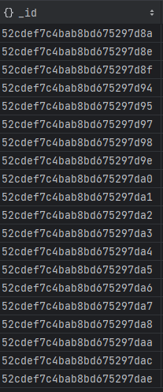
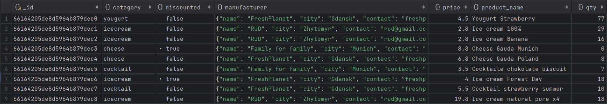

# Dokumentowe bazy danych – MongoDB

ćwiczenie 1


---

**Imiona i nazwiska autorów: Stas Kochevenko & Wiktor Dybalski**

--- 

# Zadanie 1 - połączenie z serwerem bazy danych

Połącz się serwerem MongoDB

Można skorzystać z własnego/lokanego serwera MongoDB
Można stworzyć własny klaster/bazę danych w serwisie MongoDB Atlas
- [https://www.mongodb.com/atlas/database](https://www.mongodb.com/atlas/database)

Połącz za pomocą konsoli mongsh

Ewentualnie zdefiniuj połączenie w wybranym przez siebie narzędziu

Stwórz bazę danych/kolekcję/dokument
- może to być dowolna kolekcja, dowolny dokument – o dowolnej strukturze, chodzi o przetestowanie działania połączenia


---

## Zadanie 1  - rozwiązanie

- Połączenie z bazą danych za pomocą konsoli mongosh


- Połączenie z bazą danych w narzędziu DataGrip


- Stworzenie przykładowego dokumentu & wyświetlanie zawartości

```js
db.students.insertMany([
    {age: 25,
    grade: "A",
    name: "John Doe"},

    {age: 50,
    grade: "B",
    name: "Barak Obama"}
])
```


---


# Zadanie 2 - przykładowe zbiory danych

Zaimportuj przykładowe zbory danych

MongoDB Atlas Sample Dataset
- [https://docs.atlas.mongodb.com/sample-data](https://docs.atlas.mongodb.com/sample-data)
- w przypadku importu z lokalnych plików można wykorzystać polecenie `mongorestore`
	- [https://www.mongodb.com/docs/database-tools/mongorestore/](https://www.mongodb.com/docs/database-tools/mongorestore/)

```
mongorestore <data-dump-folder>
```

np.  

```
mongorestore samples
```

- Oczywiście, w przypadku łączenia się zdalnym serwerem należy podać parametry połączenia oraz dane logowania

Yelp Dataset

- wykorzystaj komendę `mongoimport`
- [https://www.mongodb.com/docs/database-tools/mongoimport](https://www.mongodb.com/docs/database-tools/mongoimport)

```
mongoimport --db <db-name> --collection <coll-name> --type json --file <file>
```


np.

```
mongoimport --db yelp --collection business --type json --file ./yelp_academic_dataset_business.json
```

- można też wykorzystać np.  narzędzie MongoDB Compass


Zapoznaj się ze strukturą przykładowych zbiorów danych/kolekcji
- W bazach danych: MongoDB Atlas Sample Dataset
	- Skomentuj struktury użyte w dokumentach dla dwóch wybranych zbiorów (takich które wydają ci się najciekawsze)
	- np. Sample Analitics Dataset i Sampe Traning Dataset

- W bazie Yelp
	- Skomentuj struktury użyte w dokumentach bazy Yelp

Przetestuj działanie operacji
- `mongodump`
	- [https://www.mongodb.com/docs/database-tools/mongodump/](https://www.mongodb.com/docs/database-tools/mongodump/)
- `mongoexport`
	- [https://www.mongodb.com/docs/database-tools/mongoexport/](https://www.mongodb.com/docs/database-tools/mongoexport/)

---

Używając komendy mongorestore importujemy dane do zdalnej bazy danych MongoDB Atlas


Przykładowe dane z kolekcji sample_weatherdata.data


Przkładowe dane z kolekcji sample_training.companies


Analizując kolekcję sample_training.companies możemy zauważyć różnego rodzaju dane


id kolekcji:



Category_code typu String


Created_at typu Date


Competitions typu listy różnego rodzaju elementów/struktur danych


Po analizie całej konkretnej kolekcji możemy powiedzieć, że przechowywane są w niej rożnego rodzaju
dane co pozwala dokłdnie opisać co przechowuje dany obiekt   

Analizując sample_geospatio.shipwrecks także zauważamy, że przedstawione dane przechowywane są w sposób przejrzysty,
czytelny, a także bardzo szczegółowy.


Korzystając z mongoimport importujemy yelp.busness.json


yelp.business.json:


Użycie polecenia mongodump


Użycie polecenia mongoexport


# Zadanie 3 - operacje CRUD, operacje wyszukiwania danych

[https://www.mongodb.com/docs/manual/crud/](https://www.mongodb.com/docs/manual/crud/)

Stwórz nową bazę danych
- baza danych będzie przechowywać informacje o klientach, produktach, zamowieniach tych produktów. itp.
- w nazwie bazy danych użyj swoich inicjałów
	- np. `AB-orders`
- zaproponuj strukturę kolekcji/dokumentów (dwie, maksymalnie 3 kolekcje)
	- wykorzystaj typy proste/podstawowe, dokumenty zagnieżdżone, tablice itp.
	- wprowadź kilka przykładowych dokumentów
	- przetestuj operacje wstawiania, modyfikacji/usuwania dokumentów
	- przetestuj operacje wyszukiwania dokumentów

## Zadanie 3  - rozwiązanie

- Uworzenie bazy danych

```js
use SK-orders
```

- Wstawienie danych do tabeli Suppliers

```js
db.suppliers.insertMany([
   {
       name: "FreshPlanet",
       address: {country: "Poland", city: "Gdansk", address: "Wielkiego street, 34"},
       contact: ["freshplanet@gmail.com", "+48 729 14 25"]
   },

   {
       name: "RUD",
       address: {country: "Ukraine", city: "Zhytomyr", address: "Gonty street, 8"},
       contact: ["rud_factory@gmail.com", "+38 (097) 226 47 85"]
   },

   {
       name: "Family for family",
       address: {country: "Germany", city: "Munich", address: "Marienplatz street, 34"},
       contact: ["family4family@gmail.com"]
   },

   {
       name: "Mlekoraj",
       address: {country: "Poland", city: "Warsaw", address: "Pokoju, 40"},
       contact: ["mlekoraj@gmail.com", "+48 355 19 80"]
   },
])
```


- Wstawienie danych do tabeli Products

```js
db.products.insertMany([
    {
        product_name: "Yougurt Strawberry",
        category: "yougurt",
        qty: 77,
        price: 4.50,
        manufacturer: {
                          name: "FreshPlanet",
                          city: "Gdansk",
                          contact: "freshplanet@gmail.com"
                      },
        discounted: false},

    {
        product_name: "Ice cream 100%",
        category: "icecream",
        qty: 29,
        price: 2.80,
        manufacturer: {
                          name: "RUD",
                          city: "Zhytomyr",
                          contact: "rud@gmail.com"
                      },
        discounted: false},

    {
        product_name: "Ice cream Banana",
        category: "icecream",
        qty: 16,
        price: 2.80,
        manufacturer: {
                          name: "RUD",
                          city: "Zhytomyr",
                          contact: "rud@gmail.com"
                      },
        discounted: false},

    {
        product_name: "Cheese Gauda Munich",
        category: "cheese",
        qty: 0,
        price: 8.80,
        manufacturer: {
                          name: "Family for family",
                          city: "Munich",
                          contact: "family4family@gmail.com"
                      },
        discounted: true},

    {
        product_name: "Cheese Gauda Poland",
        category: "cheese",
        qty: 8,
        price: 6.80,
        manufacturer: {
                          name: "FreshPlanet",
                          city: "Gdansk",
                          contact: "freshplanet@gmail.com"
                      },
        discounted: false},

    {
        product_name: "Сocktaile chokolate biscuit",
        category: "cocktail",
        qty: 7,
        price: 3.50,
        manufacturer: {
                          name: "Family for family",
                          city: "Munich",
                          contact: "family4family@gmail.com"
                      },
        discounted: false},

    {
        product_name: "Ice cream Forest Day",
        category: "icecream",
        qty: 18,
        price: 4.00,
        manufacturer: {
                          name: "FreshPlanet",
                          city: "Gdansk",
                          contact: "freshplanet@gmail.com"
                      },
        discounted: true},

    {
        product_name: "Cocktail strawberry summer",
        category: "cocktail",
        qty: 10,
        price: 5.50,
        manufacturer: {
                          name: "FreshPlanet",
                          city: "Gdansk",
                          contact: "freshplanet@gmail.com"
                      },
        discounted: false},
    {
        product_name: "Ice cream natural pure x4",
        category: "icecream",
        qty: 18,
        price: 19.80,
        manufacturer: {
                          name: "RUD",
                          city: "Zhytomyr",
                          contact: "rud@gmail.com"
                      },
        discounted: false}
])
```



- Wstawienie danych do tabeli Orders

```js
db.orders.insertMany([
{
        orderdate: new Date("2024-04-06"),
        customer: {
                     firstname: "Simon",
                     lastname: "Cherry",
                     address: "Green Street",
                     house: "18",
                     contact: "simoncherry@gmail.com"
        },
        order_details: [{
            product_name: "Ice cream 100%",
            qty: 3,
            discount: 1
        },
        {
            product_name: "Cheese Gauda Poland",
            qty: 1,
            discount: 0.75
        },
        {
            product_name: "Сocktaile chokolate biscuit",
            qty: 2,
            discount: 1
        }]
},

{
        orderdate: new Date("2024-04-07"),
        customer: {
                     firstname: "Agatha",
                     lastname: "Black",
                     address: "Cream Street",
                     house: "15",
                     contact: "agablack@gmail.com"
        },
        order_details: [{
            product_name: "Ice cream Banana",
            qty: 2,
            discount: 0.9
        },
        {
            product_name: "Cocktail strawberry summer",
            qty: 2,
            discount: 1
        }]
},

{
        orderdate: new Date("2024-04-10"),
        customer: {
                     firstname: "Viktoria",
                     lastname: "Secret",
                     address: "Times Square",
                     house: "10",
                     contact: "vscret@gmail.com"
        },
        order_details: [{
            product_name: "Ice cream 100%",
            qty: 2,
            discount: 1
        },
        {
            product_name: "Ice cream Banana",
            qty: 2,
            discount: 1
        },
        {
            product_name: "Ice cream natural pure x4",
            qty: 1,
            discount: 0.8
        }]
},

{
        orderdate: new Date("2024-04-10"),
        customer: {
                     firstname: "Andrew",
                     lastname: "Beer",
                     address: "Patrick Street",
                     house: "8",
                     contact: "beerandr@gmail.com"
        },
        order_details: [{
            product_name: "Yougurt Strawberry",
            qty: 1,
            discount: 1
        }]
}
])
```


- Testowanie update

Na przykładzie tabeli products przetestowaliśmy prosty update danych

```js
db.products.updateOne(
  { product_name: 'Yougurt Strawberry' },
  {
    $set: { qty: 76 },
  }
);
```


Zauważyliśmy powielanie danych w tabeli products, więc spróbowaliśmy bardziej złożony update do zmiany danych o dostawcach.

Zmienimy nazwę pola:

```js
db.products.updateMany(
   {},
   { $rename: { 'manufacturer': 'supplier_id' } }
)
```

Update zmienia zagnieżdzone powielane dane na id z kolekcji Suppliers:

```js
db.products.updateOne(
  { product_name: 'Yougurt Strawberry' },
  {
    $set: { supplier_id: "66153f52ba66ac47ca309b17" },
  }
);

db.products.updateOne(
  { product_name: 'Cheese Gauda Poland' },
  {
    $set: { supplier_id: "66153f52ba66ac47ca309b17" },
  }
);

db.products.updateOne(
  { product_name: 'Ice cream Forest Day' },
  {
    $set: { supplier_id: "66153f52ba66ac47ca309b17" },
  }
);

db.products.updateOne(
  { product_name: 'Cocktail strawberry summer' },
  {
    $set: { supplier_id: "66153f52ba66ac47ca309b17" },
  }
);

db.products.updateOne(
  { product_name: 'Ice cream 100%' },
  {
    $set: { supplier_id: "66153f52ba66ac47ca309b18" },
  }
);

db.products.updateOne(
  { product_name: 'Ice cream Banana' },
  {
    $set: { supplier_id: "66153f52ba66ac47ca309b18" },
  }
);

db.products.updateOne(
  { product_name: 'Ice cream natural pure x4' },
  {
    $set: { supplier_id: "66153f52ba66ac47ca309b18" },
  }
);

db.products.updateOne(
  { product_name: 'Сocktaile chokolate biscuit' },
  {
    $set: { supplier_id: "66153f52ba66ac47ca309b19" },
  }
);

db.products.updateOne(
  { product_name: 'Cheese Gauda Munich' },
  {
    $set: { supplier_id: "66153f52ba66ac47ca309b19" },
  }
);
```


- Testowanie delete

Spróbujmy usunąć ostatni dokument z kolekcji Suppliers, nie jest on używany

```js
db.suppliers.deleteOne(
    {   name: "Mlekoraj" }
)
```


- Testowanie insert

Spróbujmy dodać nowy dokument do kolekcji Suppliers

```js
db.suppliers.insertOne({
       name: "MicroMilk",
       address: {country: "Poland", city: "Wroclaw", address: "Berska street, 34"},
       contact: ["micromilk@gmail.com", "+48 187 12 90"],
       additional_info: "10.04-12.04.2024 - discount 15% on whole products"
   })
```

Jak widać, MongoDB pozwala na dodawanie nowych pól dla pojedynczych dokumentów, i to nie prowadzi do zakłuceń lub błędów


- Testowanie find (wyszukiwanie danych)

Wszystkie dostawcy z Polski:

```js
db.suppliers.find({"address.country": "Poland"})
```


Wszystkie produkty z kategorii "icecream" albo "yougurt":

```js
db.products.find({category: {$in: ["yougurt", "icecream"]}})
```


Dodamy drugi warunek na cenę większą od 3:

```js
db.products.find({category: {$in: ["yougurt", "icecream"]}, price: {$gt: 3}})
```


Spróbujmy wyświetlić produkty potrzebujące uwagi menadżerów: albo skasowane, albo takie, których zostało mniej niż 10.

```js
db.products.find({$or: [
   {qty: {$lt: 10}}, {discounted: "true"}
]})
```


Możemy poszukać zamówienie, w którym jeden z produktów miał zniżkę 75%. Wyświetlimy tylko id zamówienia i datę.

```js
db.orders.find({$or: [{"order_details.discount": {$eq: 0.75}}]},
               {_id: 1, orderdate: 1})
```


Albo można też tak:

```js
db.orders.find({$or: [{"order_details.discount": {$eq: 0.75}}]},
               {customer: 0, order_details: 0})
```


---

Ćwiczenie przeznaczone jest do wykonania podczas zajęć. Pod koniec zajęć należy przesłać wyniki prac

Punktacja:

|         |     |
| ------- | --- |
| zadanie | pkt |
| 1       | 0,1 |
| 2       | 0,2 |
| 3       | 0,7 |
| razem   | 1   |
