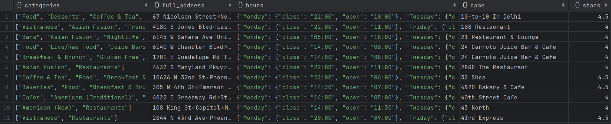
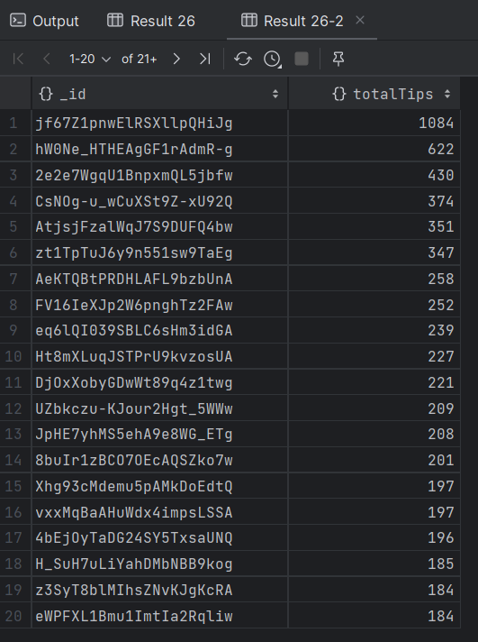
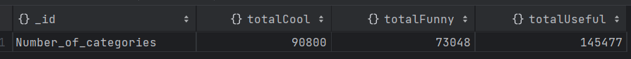
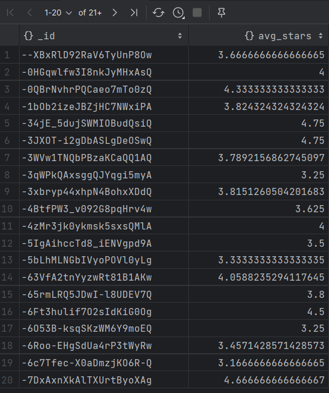

# Dokumentowe bazy danych – MongoDB

ćwiczenie 2


---

**Imiona i nazwiska autorów: Stas Kochevenko & Wiktor Dybalski**

--- 


## Yelp Dataset

- [www.yelp.com](http://www.yelp.com) - serwis społecznościowy – informacje o miejscach/lokalach
- restauracje, kluby, hotele itd. `businesses`,
- użytkownicy odwiedzają te miejsca - "meldują się"  `check-in`
- użytkownicy piszą recenzje `reviews` o miejscach/lokalach i wystawiają oceny oceny,
- przykładowy zbiór danych zawiera dane z 5 miast: Phoenix, Las Vegas, Madison, Waterloo i Edinburgh.

# Zadanie 1 - operacje wyszukiwania danych

Dla zbioru Yelp wykonaj następujące zapytania

W niektórych przypadkach może być potrzebne wykorzystanie mechanizmu Aggregation Pipeline

[https://www.mongodb.com/docs/manual/core/aggregation-pipeline/](https://www.mongodb.com/docs/manual/core/aggregation-pipeline/)


1. Zwróć dane wszystkich restauracji (kolekcja `business`, pole `categories` musi zawierać wartość "Restaurants"), które są otwarte w poniedziałki (pole hours) i mają ocenę co najmniej 4 gwiazdki (pole `stars`).  Zapytanie powinno zwracać: nazwę firmy, adres, kategorię, godziny otwarcia i gwiazdki. Posortuj wynik wg nazwy firmy.

2. Ile każda firma otrzymała ocen/wskazówek (kolekcja `tip` ) w 2012. Wynik powinien zawierać nazwę firmy oraz liczbę ocen/wskazówek Wynik posortuj według liczby ocen (`tip`).

3. Recenzje mogą być oceniane przez innych użytkowników jako `cool`, `funny` lub `useful` (kolekcja `review`, pole `votes`, jedna recenzja może mieć kilka głosów w każdej kategorii).  Napisz zapytanie, które zwraca dla każdej z tych kategorii, ile sumarycznie recenzji zostało oznaczonych przez te kategorie (np. recenzja ma kategorię `funny` jeśli co najmniej jedna osoba zagłosowała w ten sposób na daną recenzję)

4. Zwróć dane wszystkich użytkowników (kolekcja `user`), którzy nie mają ani jednego pozytywnego głosu (pole `votes`) z kategorii (`funny` lub `useful`), wynik posortuj alfabetycznie według nazwy użytkownika.

5. Wyznacz, jaką średnia ocenę uzyskała każda firma na podstawie wszystkich recenzji (kolekcja `review`, pole `stars`). Ogranicz do firm, które uzyskały średnią powyżej 3 gwiazdek.

	a) Wynik powinien zawierać id firmy oraz średnią ocenę. Posortuj wynik wg id firmy.

	b) Wynik powinien zawierać nazwę firmy oraz średnią ocenę. Posortuj wynik wg nazwy firmy.

## Zadanie 1  - rozwiązanie

1. Zwróć dane wszystkich restauracji (kolekcja `business`, pole `categories` musi zawierać wartość "Restaurants"), które są otwarte w poniedziałki (pole hours) i mają ocenę co najmniej 4 gwiazdki (pole `stars`).  Zapytanie powinno zwracać: nazwę firmy, adres, kategorię, godziny otwarcia i gwiazdki. Posortuj wynik wg nazwy firmy.

```js
db.business.find({categories: "Restaurants", "hours.Monday.open": {$exists: true}, stars: {$gte: 4}},
 {"_id": 0, "name": 1, "full_address": 1, "categories": 1, "hours": 1, "stars": 1}).sort({"name": 1})
```

Wynik zapytania:




2. Ile każda firma otrzymała ocen/wskazówek (kolekcja `tip` ) w 2012. Wynik powinien zawierać nazwę firmy oraz liczbę ocen/wskazówek Wynik posortuj według liczby ocen (`tip`).

```js
db.tip.aggregate([
    {$match: {date: {$gte: "2012-01-01", $lte: "2012-12-31"}}},
    {$group: {_id: "$business_id", totalTips: {$sum: 1}}},
    {$sort: {totalTips: -1}}
                    ])
```

Wynik zapytania:



3. Recenzje mogą być oceniane przez innych użytkowników jako `cool`, `funny` lub `useful` (kolekcja `review`, pole `votes`, jedna recenzja może mieć kilka głosów w każdej kategorii).  Napisz zapytanie, które zwraca dla każdej z tych kategorii, ile sumarycznie recenzji zostało oznaczonych przez te kategorie (np. recenzja ma kategorię `funny` jeśli co najmniej jedna osoba zagłosowała w ten sposób na daną recenzję).

```js
db.review1.aggregate([
    {$group: {
    _id: "Number_of_categories",
    totalFunny: {$sum: {
        $cond: {if: {$gt: ["$votes.funny", 0]},
                          then: 1, else: 0}}},
    totalUseful: {$sum: {
        $cond: {if: {$gt: ["$votes.useful", 0]},
                          then: 1, else: 0}}},
    totalCool: {$sum: {
        $cond: {if: {$gt: ["$votes.cool", 0]},
                          then: 1, else: 0}}}
    }}
])
```

Wynik zapytania:



4. Zwróć dane wszystkich użytkowników (kolekcja `user`), którzy nie mają ani jednego pozytywnego głosu (pole `votes`) z kategorii (`funny` lub `useful`), wynik posortuj alfabetycznie według nazwy użytkownika.

```js
db.user.aggregate([
    {
        $group: {
            _id: "$name",
            totalFunny: {$sum: {$cond: {if: {$gt: ["$votes.funny", 0]}, then: "$votes.funny", else: 0}}},
            totalUseful: {$sum: {$cond: {if: {$gt: ["$votes.useful", 0]}, then: "$votes.useful", else: 0}}}
        }
    },
    {
        $match: {
            totalFunny: 0,
            totalUseful: 0
        }
    },
    {
        $project: {
            _id: 0,
            name: "$_id",
            totalFunny: 1,
            totalUseful: 1
        }
    },
    {
        $sort: {name: 1}
    }
])
```


5. Wyznacz, jaką średnia ocenę uzyskała każda firma na podstawie wszystkich recenzji (kolekcja `review`, pole `stars`). Ogranicz do firm, które uzyskały średnią powyżej 3 gwiazdek.

a) Wynik powinien zawierać id firmy oraz średnią ocenę. Posortuj wynik wg id firmy.

```js
db.review1.aggregate([
    {$group: {
        _id: "$business_id",
        avg_stars: {$avg: "$stars"}
    }},
    {$match: {
        "avg_stars": {$gt: 3}
    }},
    {$sort: {
        _id: 1
    }}
])
```

Wynika zapytania A:



5. Wyznacz, jaką średnia ocenę uzyskała każda firma na podstawie wszystkich recenzji (kolekcja `review`, pole `stars`). Ogranicz do firm, które uzyskały średnią powyżej 3 gwiazdek.

b) Wynik powinien zawierać nazwę firmy oraz średnią ocenę. Posortuj wynik wg nazwy firmy.

```js
db.review1.aggregate([
    {$group: {
        _id: "$business_id",
        avg_stars: {$avg: "$stars"}
        }
    },
    {$lookup: {
        from: "business",
        localField: "_id",
        foreignField: "business_id",
        as: "business-info"
        }
    },
    {$unwind: "$business-info"},
    {$project: {
            _id: 0,
            business_name: "$business-info.name",
            avg_stars: 1
        }
    },
    {$sort:
        {business_name: 1}
        }
])
```

Wynik zapytania B:


# Zadanie 2 - modelowanie danych


Zaproponuj strukturę bazy danych dla wybranego/przykładowego zagadnienia/problemu

Należy wybrać jedno zagadnienie/problem (A lub B)

Przykład A
- Wykładowcy, przedmioty, studenci, oceny
	- Wykładowcy prowadzą zajęcia z poszczególnych przedmiotów
	- Studenci uczęszczają na zajęcia
	- Wykładowcy wystawiają oceny studentom
	- Studenci oceniają zajęcia

Przykład B
- Firmy, wycieczki, osoby
	- Firmy organizują wycieczki
	- Osoby rezerwują miejsca/wykupują bilety
	- Osoby oceniają wycieczki

a) Warto zaproponować/rozważyć różne warianty struktury bazy danych i dokumentów w poszczególnych kolekcjach oraz przeprowadzić dyskusję każdego wariantu (wskazać wady i zalety każdego z wariantów)

b) Kolekcje należy wypełnić przykładowymi danymi

c) W kontekście zaprezentowania wad/zalet należy zaprezentować kilka przykładów/zapytań/zadań/operacji oraz dla których dedykowany jest dany wariant

W sprawozdaniu należy zamieścić przykładowe dokumenty w formacie JSON ( pkt a) i b)), oraz kod zapytań/operacji (pkt c)), wraz z odpowiednim komentarzem opisującym strukturę dokumentów oraz polecenia ilustrujące wykonanie przykładowych operacji na danych

Do sprawozdania należy kompletny zrzut wykonanych/przygotowanych baz danych (taki zrzut można wykonać np. za pomocą poleceń `mongoexport`, `mongdump` …) oraz plik z kodem operacji zapytań (załącznik powinien mieć format zip).


## Zadanie 2  - rozwiązanie
### Podejście tabelaryczne

- a)  Analiza danego wariantu

Podejście tabelaryczne jest znane z modelu relacyjnego: uporządkujemy dane w taki sposób, że każda tabela/kolekcja reprezentuje pewien rodzaj encji, np. Klienci, Nauczyciele, Przedmioty. Encje są powiązane między sobą przez referencje.

- Zalety
    - Bardziej przejrzysty model danych: dane są pogrupowane w taki sposób, że nie ma potrzeby nadużywania dokumentów zagnieżdżonych
    - Brak redundancji danych
    - Szybka modyfikacji danych: dzięki temu, że nie ma redundancji, potrzebujemy modyfikować dane tylko w jednym miejscu
    - Zapewniona spójność danych: modyfikacja danych tylko w jednym miejscu zapewnia, że dane będą spójne
    - Większa wydajność w sytuacji, gdy potrzebujemy danych dotyczących konkretnego małego dokumentu, a nie całego dokumentu wraz z zagnieżdżonymi dokumentami

- Wady
    - Konieczność używania operacji łączenia dokumentów różnych kolekcji w sytuacji, gdy potrzebujemy dokument wraz z dokumentami, które znajdują się z nim w relacji
    - Konieczność użycia złożonych zapytań (w MongoDB) do łączenia wielu dokumentów z różnych kolekcji
    - W przypadku wielokrotnego odczytywania danych z powiązanych między sobą dokumentów różnych kolekcji zmniejsza się wydajność, ponieważ za każdym razem potrzebujemy ponownie łączyć dane

```js
Companies
{
	"_id": ObjectId, 
	"companies_id": Number,
	"name": String, 
	"organized_trips_id": [Number], 
}

Customers
{
	"_id": ObjectId, 
	"customer_id": Number,
	"first_name": String,
	"last_name": String, 
	"owned_tickets_id": [Number], 
	"customer_review_id": [Number] 
}

Trips 
{
	"_id": ObjectId, 
	"trip_id": Number, 
	"tickets_id": [Number], 
	"date": Date, 
	"location": String, 
	"trip_review_id": [Number] 
}

Tickets 
{
	"_id": ObjectId, 
	"ticket_id": Number, 
	"reserved_seat_no": Number, 
	"last_name_person": String 
}

Reviews
{
	"_id": ObjectId,
	"review_id": Number, 
	"customer_id": Number,
	"trip_id": Number, 
	"company_id": Number, 
	"review_date": Date, 
	"stars": Number, 
	"review_description": String
}
```

Stworzenie bazy danych według wyżej przedstawionego pomysłu:
```js
use Trip_database

db.createCollection("Companies")
db.createCollection("Customers")
db.createCollection("Trips")
db.createCollection("Tickets")
db.createCollection("Reviews")
```

Stworzenie rożnego rodzaju danych dla przykładowej bazy danych:
    
Kilka przydatnych informacji:
    
- took_place ustawione na True w kolekcji Trips oznacza, że wycieczka się już odbyła,
- review_id oraz ticket_id to liczby 3-cyfrowe zaczynające się od trip_id. 3 bilety dla np. trip_id=1 to: 101,102,103,
- seats_no to liczby odpowiadające numerom ticketów: np dla ticketa 102, seats_no to 2 itd

```js
db.Companies.insertMany([
  { "_id": {"_id": ObjectId("5f8d0a55fc13ae03c3000001")}, "companies_id": 1, "organized_trips_id": [1, 2], "company_name": "Adventure Works" },
  { "_id": {"_id": ObjectId("5f8d0a55fc13ae03c3000002")}, "companies_id": 2, "organized_trips_id": [3, 4], "company_name": "Travel Corp" },
  { "_id": {"_id": ObjectId("5f8d0a55fc13ae03c3000003")}, "companies_id": 3, "organized_trips_id": [5], "company_name": "Holiday Makers" },
  { "_id": {"_id": ObjectId("5f8d0a55fc13ae03c3000004")}, "companies_id": 4, "organized_trips_id": [6, 7], "company_name": "Globe Trotters" },
  { "_id": {"_id": ObjectId("5f8d0a55fc13ae03c3000005")}, "companies_id": 5, "organized_trips_id": [8], "company_name": "Pathfinders" }
])

db.Customers.insertMany([
  { "_id": {"_id": ObjectId("5f8d0a55fc13ae03c3000006")}, "customer_id": 1, "owned_tickets_id": [101, 102, 504], "customer_review_id": [101, 102], "first_name": "John", "last_name": "Doe" },
  { "_id": {"_id": ObjectId("5f8d0a55fc13ae03c3000007")}, "customer_id": 2, "owned_tickets_id": [201], "customer_review_id": [201], "first_name": "Anna", "last_name": "Smith" },
  { "_id": {"_id": ObjectId("5f8d0a55fc13ae03c3000008")}, "customer_id": 3, "owned_tickets_id": [401], "customer_review_id": [], "first_name": "David", "last_name": "Brown" },
  { "_id": {"_id": ObjectId("5f8d0a55fc13ae03c3000009")}, "customer_id": 4, "owned_tickets_id": [501, 502], "customer_review_id": [], "first_name": "Lisa", "last_name": "White" },
  { "_id": {"_id": ObjectId("5f8d0a55fc13ae03c300000a")}, "customer_id": 5, "owned_tickets_id": [503], "customer_review_id": [], "first_name": "Mark", "last_name": "Taylor" }
])


db.Trips.insertMany([
  { "_id": {"_id": ObjectId("5f8d0a55fc13ae03c300000b")}, "trip_id": 1, "tickets_id": [101, 102, 103], "date": {"$date": "2024-04-15T00:00:00Z"}, "location": "Warsaw", "trip_review_id": [100, 101], "took_place": true },
  { "_id": {"_id": ObjectId("5f8d0a55fc13ae03c300000c")}, "trip_id": 2, "tickets_id": [201, 202], "date": {"$date": "2024-05-20T00:00:00Z"}, "location": "Krakow", "trip_review_id": [201, 202], "took_place": true },
  { "_id": {"_id": ObjectId("5f8d0a55fc13ae03c300000d")}, "trip_id": 3, "tickets_id": [301], "date": {"$date": "2024-06-10T00:00:00Z"}, "location": "Gdansk", "trip_review_id": [301], "took_place": true },
  { "_id": {"_id": ObjectId("5f8d0a55fc13ae03c300000e")}, "trip_id": 4, "tickets_id": [401], "date": {"$date": "2024-07-15T00:00:00Z"}, "location": "Poznan", "trip_review_id": [], "took_place": false },
  { "_id": {"_id": ObjectId("5f8d0a55fc13ae03c300000f")}, "trip_id": 5, "tickets_id": [501, 502, 503, 504, 505], "date": {"$date": "2024-08-25T00:00:00Z"}, "location": "Wroclaw", "trip_review_id": [], "took_place": false }
])


db.Tickets.insertMany([
  { "_id": {"_id": ObjectId("5f8d0a55fc13ae03c3000010")}, "ticket_id": 501, "reserved_seat_no": 1, "last_name_person": "White" },
  { "_id": {"_id": ObjectId("5f8d0a55fc13ae03c3000011")}, "ticket_id": 101, "reserved_seat_no": 1, "last_name_person": "Doe" },
  { "_id": {"_id": ObjectId("5f8d0a55fc13ae03c3000012")}, "ticket_id": 102, "reserved_seat_no": 2, "last_name_person": "Doe" },
  { "_id": {"_id": ObjectId("5f8d0a55fc13ae03c3000013")}, "ticket_id": 201, "reserved_seat_no": 1, "last_name_person": "Smith" },
  { "_id": {"_id": ObjectId("5f8d0a55fc13ae03c3000014")}, "ticket_id": 502, "reserved_seat_no": 2, "last_name_person": "White" },
  { "_id": {"_id": ObjectId("5f8d0a55fc13ae03c3000015")}, "ticket_id": 503, "reserved_seat_no": 1, "last_name_person": "White" },
  { "_id": {"_id": ObjectId("5f8d0a55fc13ae03c3000016")}, "ticket_id": 401, "reserved_seat_no": 1, "last_name_person": "Brown" },
  { "_id": {"_id": ObjectId("5f8d0a55fc13ae03c3000017")}, "ticket_id": 504, "reserved_seat_no": 4, "last_name_person": "Doe" }
])

db.Reviews.insertMany([
  { "_id": {"_id": ObjectId("5f8d0a55fc13ae03c3000020")}, "review_id": 101, "customer_id": 1, "trip_id": 1, "company_id": 1, "review_date": {"$date": "2023-03-01T00:00:00Z"}, "stars": 5, "review_description": "Excellent experience!" },
  { "_id": {"_id": ObjectId("5f8d0a55fc13ae03c3000021")}, "review_id": 102, "customer_id": 1, "trip_id": 1, "company_id": 1, "review_date": {"$date": "2023-03-02T00:00:00Z"}, "stars": 4, "review_description": "Very good trip, well organized." },
  { "_id": {"_id": ObjectId("5f8d0a55fc13ae03c3000022")}, "review_id": 201, "customer_id": 2, "trip_id": 2, "company_id": 1, "review_date": {"$date": "2023-04-01T00:00:00Z"}, "stars": 3, "review_description": "Decent, but could be better." },
])

```


### Podejście dokumentowe

- a)  Analiza danego wariantu

W takim podejściu uporządkujemy dane w taki sposób, że każda kolekcja przedstawia pewien rodzaj encji, ale nie potrzebujemy przedstawiać wszystkie encje w osobnych kolekcjach. Encje mogą być powiązane między sobą przez referencje (w przypadku kilku dokumentów w różnych kolekcjach) albo za pomocą tablic i dokumentów zagnieżdżonych.

- Zalety
    - Brak konieczności używania kosztownych operacji do łączenia kilku dokumentów różnych kolekcji
    - Dobre podejście w przypadku rzadkiego modyfikowania danych, ponieważ mamy redundację danych
    - Lepsza wydajność w przypadku, gdy potrzebujemy informacji z całego dokumentu wraz z zagnieżdżonymi dokumentami
    - Utrzymywanie powiązynch elementów w jednym dokumencie poprzez użycie dokumentów zagnieżdżonych i tablic

- Wady
    - Redundacja danych
    - Utrudnienia modyfikacji: w konsekwencji redundacji danych potrzebujemy modyfikować te same dane wielokrotnie w różnych miejscah
    - Konieczność użycia bardziej złożonych zapytań w przypadku, gdy potrzebujemy dostać się do informacji zawartych w dokumentach zagnieżdżonych
    - W szczególnych przypadkach nieprzejżysty model danych (np. w przypadku wielokrotnego zagnieżdżenia dokumentów w zagnieżdżnych dokumentach)
    - Brak zagwarantowanej spójności danych


---

Punktacja:

|         |     |
| ------- | --- |
| zadanie | pkt |
| 1       | 0,6 |
| 2       | 1,4 |
| razem   | 2   |


