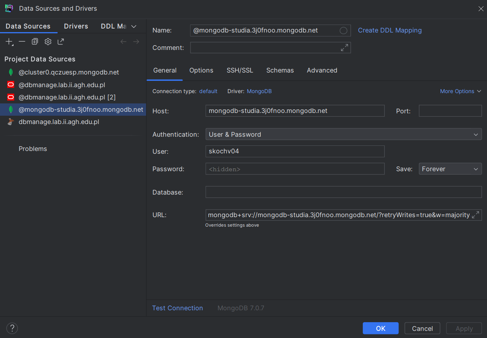
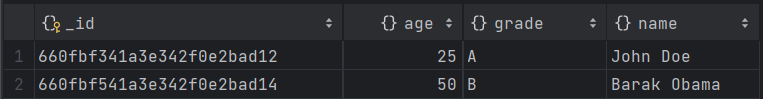
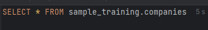
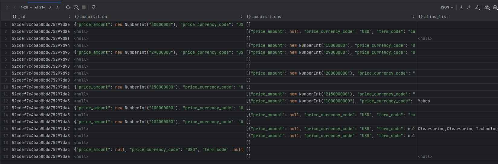
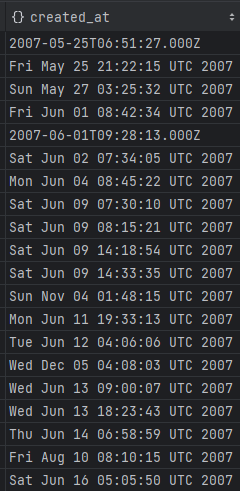
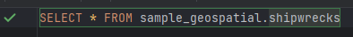
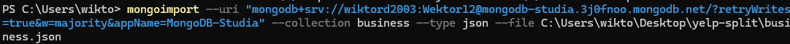
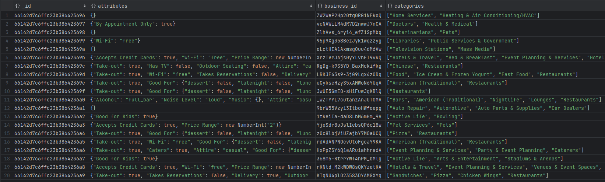

# Dokumentowe bazy danych – MongoDB

ćwiczenie 1


---

**Imiona i nazwiska autorów: Stas Kochevenko & Wiktor Dybalski**

--- 

# Zadanie 1 - połączenie z serwerem bazy danych

Połącz się serwerem MongoDB

Można skorzystać z własnego/lokanego serwera MongoDB
Można stworzyć własny klaster/bazę danych w serwisie MongoDB Atlas
- [https://www.mongodb.com/atlas/database](https://www.mongodb.com/atlas/database)

Połącz za pomocą konsoli mongsh

Ewentualnie zdefiniuj połączenie w wybranym przez siebie narzędziu

Stwórz bazę danych/kolekcję/dokument
- może to być dowolna kolekcja, dowolny dokument – o dowolnej strukturze, chodzi o przetestowanie działania połączenia


---

## Zadanie 1  - rozwiązanie

- Połączenie z bazą danych za pomocą konsoli mongosh


- Połączenie z bazą danych w narzędziu DataGrip



- Stworzenie przykładowego dokumentu & wyświetlanie zawartości

```js

```




---


# Zadanie 2 - przykładowe zbiory danych

Zaimportuj przykładowe zbory danych

MongoDB Atlas Sample Dataset
- [https://docs.atlas.mongodb.com/sample-data](https://docs.atlas.mongodb.com/sample-data)
- w przypadku importu z lokalnych plików można wykorzystać polecenie `mongorestore`
	- [https://www.mongodb.com/docs/database-tools/mongorestore/](https://www.mongodb.com/docs/database-tools/mongorestore/)

```
mongorestore <data-dump-folder>
```

np.  

```
mongorestore samples
```

- Oczywiście, w przypadku łączenia się zdalnym serwerem należy podać parametry połączenia oraz dane logowania

Yelp Dataset

- wykorzystaj komendę `mongoimport`
- [https://www.mongodb.com/docs/database-tools/mongoimport](https://www.mongodb.com/docs/database-tools/mongoimport)

```
mongoimport --db <db-name> --collection <coll-name> --type json --file <file>
```


np.

```
mongoimport --db yelp --collection business --type json --file ./yelp_academic_dataset_business.json
```

- można też wykorzystać np.  narzędzie MongoDB Compass


Zapoznaj się ze strukturą przykładowych zbiorów danych/kolekcji
- W bazach danych: MongoDB Atlas Sample Dataset
	- Skomentuj struktury użyte w dokumentach dla dwóch wybranych zbiorów (takich które wydają ci się najciekawsze)
	- np. Sample Analitics Dataset i Sampe Traning Dataset

- W bazie Yelp
	- Skomentuj struktury użyte w dokumentach bazy Yelp

Przetestuj działanie operacji
- `mongodump`
	- [https://www.mongodb.com/docs/database-tools/mongodump/](https://www.mongodb.com/docs/database-tools/mongodump/)
- `mongoexport`
	- [https://www.mongodb.com/docs/database-tools/mongoexport/](https://www.mongodb.com/docs/database-tools/mongoexport/)

---

---

Używając komendy mongorestore importujemy dane do zdalnej bazy danych MongoDB Atlas


Przykładowe dane z kolekcji sample_weatherdata.data


Przkładowe dane z kolekcji sample_training.companies



Analizując kolekcję sample_training.companies możemy zauważyć różnego rodzaju dane


id kolekcji:


Category_code typu String


Created_at typu Date



Competitions typu listy różnego rodzaju elementów/struktur danych


Po analizie całej konkretnej kolekcji możemy powiedzieć, że przechowywane są w niej rożnego rodzaju
dane co pozwala dokłdnie opisać co przechowuje dany obiekt   

Analizując sample_geospatio.shipwrecks także zauważamy, że przedstawione dane przechowywane są w sposób przejrzysty,
czytelny, a także bardzo szczegółowy.




Korzystając z mongoimport importujemy yelp.busness.json




yelp.business.json:



Użycie polecenia mongodump


Użycie polecenia mongoexport


# Zadanie 3 - operacje CRUD, operacje wyszukiwania danych

[https://www.mongodb.com/docs/manual/crud/](https://www.mongodb.com/docs/manual/crud/)

Stwórz nową bazę danych
- baza danych będzie przechowywać informacje o klientach, produktach, zamowieniach tych produktów. itp.
- w nazwie bazy danych użyj swoich inicjałów
	- np. `AB-orders`
- zaproponuj strukturę kolekcji/dokumentów (dwie, maksymalnie 3 kolekcje)
	- wykorzystaj typy proste/podstawowe, dokumenty zagnieżdżone, tablice itp.
	- wprowadź kilka przykładowych dokumentów
	- przetestuj operacje wstawiania, modyfikacji/usuwania dokumentów
	- przetestuj operacje wyszukiwania dokumentów

## Zadanie 3  - rozwiązanie

> Wyniki: 
> 
> przykłady, kod, zrzuty ekranów, komentarz ...

```js
--  ...
```


---

Ćwiczenie przeznaczone jest do wykonania podczas zajęć. Pod koniec zajęć należy przesłać wyniki prac

Punktacja:

|         |     |
| ------- | --- |
| zadanie | pkt |
| 1       | 0,1 |
| 2       | 0,2 |
| 3       | 0,7 |
| razem   | 1   |
