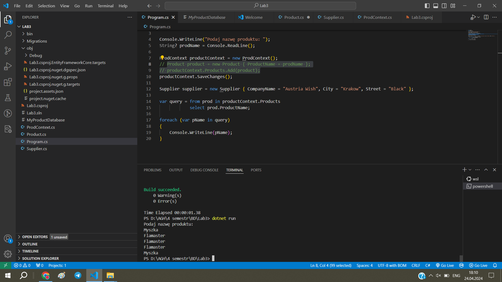

# Entity Framework

ćwiczenie 3


---

**Imiona i nazwiska autorów: Stas Kochevenko & Wiktor Dybalski**

--- 

# Zadanie 1 - wprowadzenie

Zostały dodane podstawowe klasy Product, ProdContext oraz Program, baza danych MyProductDatabase.



<!-- <div style="page-break-after: always;"></div> -->

Kod:

- Product.cs

```c#
using System.Runtime.Intrinsics.X86;

public class Product
{
    public int ProductID { get; set; }
    public String? ProductName { get; set; }
    public int UnitsInStock { get; set; }
    public override string ToString()
    {
        return $"{ProductName}: {UnitsInStock} szt";
    }
}
```

- ProdContext.cs

```c#
using Microsoft.EntityFrameworkCore;
public class ProdContext : DbContext
{
    public DbSet<Product> Products { get; set; }
    public DbSet<Supplier> Suppliers { get; set; }

    protected override void OnConfiguring(DbContextOptionsBuilder optionsBuilder)
    {
        base.OnConfiguring(optionsBuilder);
        optionsBuilder.UseSqlite("Datasource=MyProductDatabase");
    }
}
```

- Program.cs

```c#
using System;
using System.Linq;

Console.WriteLine("Podaj nazwę produktu: ");
String? prodName = Console.ReadLine();

ProdContext productContext = new ProdContext();

Product product = new Product { ProductName = prodName, UnitsInStock = 24, Supplier = supplier };
productContext.Products.Add(product);
productContext.SaveChanges();

var query = from prod in productContext.Products
            select new { prod.ProductID, prod.ProductName };

foreach (var pName in query)
{
    Console.WriteLine(pName);
}
```


---