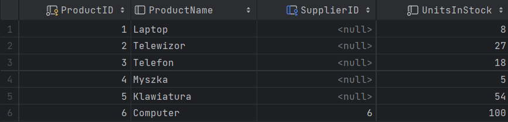
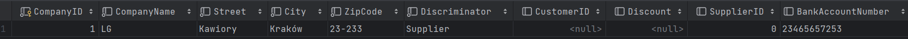
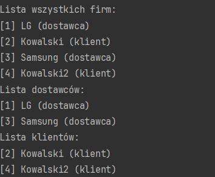
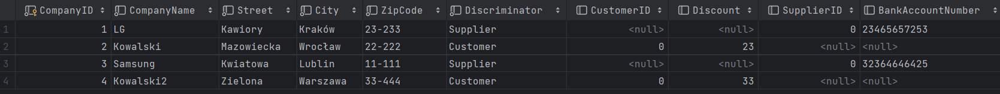
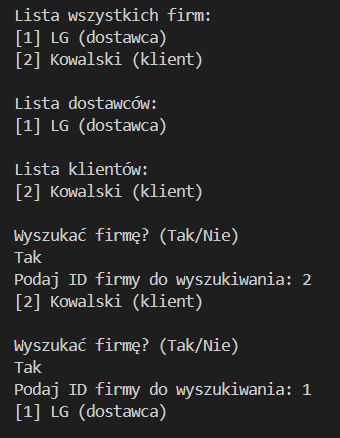
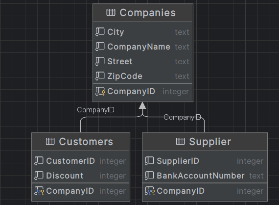

# Entity Framework

ćwiczenie 3


---

**Imiona i nazwiska autorów: Stas Kochevenko & Wiktor Dybalski**

--- 

# Wproradzenie

Zostały dodane podstawowe klasy Product, ProdContext oraz Program, baza danych MyProductDatabase.


<!-- <div style="page-break-after: always;"></div> -->

Kod:

- Product.cs

```c#
using System.Runtime.Intrinsics.X86;

public class Product
{
    public int ProductID { get; set; }
    public String? ProductName { get; set; }
    public int UnitsInStock { get; set; }
}
```

- ProdContext.cs

```c#
using Microsoft.EntityFrameworkCore;
public class ProdContext : DbContext
{
    public DbSet<Product> Products { get; set; }

    protected override void OnConfiguring(DbContextOptionsBuilder optionsBuilder)
    {
        base.OnConfiguring(optionsBuilder);
        optionsBuilder.UseSqlite("Datasource=MyProductDatabase");
    }
}
```

- Program.cs

```c#
using System;
using System.Linq;

Console.WriteLine("Podaj nazwę produktu: ");
String? prodName = Console.ReadLine();

ProdContext productContext = new ProdContext();

Product product = new Product { ProductName = prodName, UnitsInStock = 24, Supplier = supplier };
productContext.Products.Add(product);
productContext.SaveChanges();

var query = from prod in productContext.Products
            select new { prod.ProductID, prod.ProductName };

foreach (var pName in query)
{
    Console.WriteLine(pName);
}
```

--- 

# Zadanie a - wprowadzenie pojęcia Dostawcy

Została dodana klasa Supplier oraz zaktualizowana odpowiednio klasa Product, żeby mieć połączenie z klasą Supplier.

Schemat zmienionej bazy danych, wygenerowany przez DataGrip:


Testowanie dodania nowego dostawcy i ustawienia dostawcy poprzednio wprowadzonego produktu na dodanego dostawcę. Tabela Products przed wywołaniem metody dodającej:


Wynik działania programu w postaci konsolowych komunikatów:


Sprawdżmy trwałość zmian za pomocą DataGrip:



Testowanie ustawienia dostawcy dla poprzednio wprowadzonego produktu. Wynik działania programu w postaci konsolowych komunikatów:


Sprawdżmy trwałość zmian za pomocą DataGrip:


Kod:

- Product.cs

```c#
using System.Runtime.Intrinsics.X86;

using System.Runtime.Intrinsics.X86;

public class Product
{
    public int ProductID { get; set; }
    public String? ProductName { get; set; }
    public int UnitsInStock { get; set; }
    public Supplier? supplier { get; set; } = null;
    public override string ToString()
    {
        string supName = "undefined";
        if (supplier != null)
        {
            supName = supplier.CompanyName;
        }
        return $"{ProductName}: {UnitsInStock} szt. Dostawca: {supName}";
    }
}
```

- Supplier.cs

```c#
public class Supplier
{
    public int SupplierID { get; set; }
    public string CompanyName { get; set; }
    public string Street { get; set; }
    public string City { get; set; }
    public override string ToString()
    {
        return CompanyName;
    }
}
```

- ProdContext.cs

```c#
using Microsoft.EntityFrameworkCore;
public class ProdContext : DbContext
{
    public DbSet<Product> Products { get; set; }
    public DbSet<Supplier> Suppliers { get; set; }

    protected override void OnConfiguring(DbContextOptionsBuilder optionsBuilder)
    {
        base.OnConfiguring(optionsBuilder);
        optionsBuilder.UseSqlite("Datasource=MyProductDatabase");
    }
}
```

- Program.cs

```c#
class Program
{
    private static Product createNewProduct()
    {
        Console.Write("Podaj nazwę nowego produktu: ");
        string prodName = Console.ReadLine();
        Console.Write("Podaj ilość jednostek danego produktu dostępnych w sklepie: ");
        int quantity = Int32.Parse(Console.ReadLine());

        Product product = new Product { ProductName = prodName, UnitsInStock = quantity };
        Console.Write($"Został utworzony produkt: {product};");

        return product;
    }

    private static Product findProduct(ProdContext productContext)
    {
        Console.Write("Podaj ID produktu do wyszukiwania: ");
        int prodID = Int32.Parse(Console.ReadLine());

        var query = from prod in productContext.Products
                    where prod.ProductID == prodID
                    select prod;

        return query.FirstOrDefault();
    }

    private static void showAllProducts(ProdContext productContext)
    {
        Console.WriteLine("Lista produktów: ");
        foreach (Product product in productContext.Products)
        {
            Console.WriteLine($"{product.ProductID} | {product}");
        }

    }

    private static Supplier createNewSupplier()
    {
        Console.Write("Podaj nazwę nowego dostawcy: ");
        string companyName = Console.ReadLine();
        Console.Write("Podaj nazwę miasta: ");
        string city = Console.ReadLine();
        Console.Write("Podaj nazwę ulicy: ");
        string street = Console.ReadLine();

        Supplier supplier = new Supplier { CompanyName = companyName, City = city, Street = street };
        Console.Write($"Został utworzony dostawca: {supplier}.\n");

        return supplier;
    }

    private static Supplier findSupplier(ProdContext productContext)
    {
        Console.Write("Podaj ID dostawcy do wyszukiwania: ");
        int supplierID = Int32.Parse(Console.ReadLine());

        var query = from supplier in productContext.Suppliers
                    where supplier.SupplierID == supplierID
                    select supplier;

        return query.FirstOrDefault();
    }

    private static void showAllSuppliers(ProdContext productContext)
    {
        Console.WriteLine("Lista dostawców: ");
        foreach (Supplier supplier in productContext.Suppliers)
        {
            Console.WriteLine($"{supplier.SupplierID} | {supplier}");
        }

    }

    static void Main()
    {
        ProdContext productContext = new ProdContext();

        Supplier supplier = null;

        Console.WriteLine("Dodać nowego dostawcę? (Tak/Nie)");
        string choice = Console.ReadLine();
        bool correctAnswer = false;
        do
        {
            switch (choice)
            {
                case "Tak":
                    supplier = createNewSupplier();
                    productContext.Suppliers.Add(supplier);
                    correctAnswer = true;
                    break;
                case "Nie":
                    showAllSuppliers(productContext);
                    supplier = findSupplier(productContext);
                    correctAnswer = true;
                    break;
            }
        } while (!correctAnswer);

        productContext.SaveChanges();

        Console.WriteLine("");

        Product product = findProduct(productContext);

        Console.WriteLine("");

        Console.WriteLine("Zmienić dostawcę dla produktu na podanego wyżej? (Tak/Nie)");
        choice = Console.ReadLine();
        correctAnswer = false;
        do
        {
            switch (choice)
            {
                case "Tak":
                    product.supplier = supplier;
                    Console.Write($"\nDla productu: {product.ProductName} zmieniono dostawcę na: {supplier.CompanyName}.\n");
                    productContext.SaveChanges();
                    correctAnswer = true;
                    break;
                case "Nie":
                    correctAnswer = true;
                    break;
            }
        } while (!correctAnswer);

        showAllProducts(productContext);

        showAllSuppliers(productContext);
    }
}
```

--- 

# Zadanie b - odwrócenie relacji Supplier -> Product

- Z klasy "Product" został usunięty atrybut "Supplier" zgodnie ze schematem. 
- W klasie "Supplier" dodano kolekcję produktów, dostarczanych przez danego dostawcę.
- W kodzie głównego programu został dodany fragment kodu odpowiedzialny za dodanie nowych produktów. W poruwnywniu do zadania 1, jedyną zmianą było ustawienie produktu do dostawcy, zamiast ustawienia dostawcy do produktu. Niżej będzie podany fragment kodu, który uległ zmianie.
- Klasa ProdContext pozostała bez zmian.

Schemat zmienionej bazy danych, wygenerowany przez DataGrip:


Jak widać, pomimo odwrócenia relacji, schemat bazy danych się nie zmienił. Entity Framework dokonał optymalizacji, dzięki czemu uniknęliśmy powielania danych w tabeli Suppliers (ponieważ nie możemy trzymać listy w polu). Oprócz tego takie podejście miało by gorsze konsekwencje: każdy rekord miałby nowy SupplierID, mimo że byłby to ten sam dostawca, jedynie mający przypisany inny ProductID. W takiej sytuacji nie bylibyśmy w stanie odróżnic dostawców.

Testowanie dodania nowych produktów i ustawienia ich dostawcy na nowo stworzonego. Tabela Products przed wywołaniem metody dodającej:


Wynik działania programu w postaci konsolowych komunikatów:


Sprawdżmy trwałość zmian za pomocą DataGrip. Tabela Product po dodaniu produktów:


Tabela Product po wprowadzeniu zmiany dostawcy:


Kod:

- Product.cs

```c#
using System.Runtime.Intrinsics.X86;

public class Product
{
    public int ProductID { get; set; }
    public String? ProductName { get; set; }
    public int UnitsInStock { get; set; }
    public override string ToString()
    {
        return $"{ProductName}: {UnitsInStock} szt.";
    }
}
```

- Supplier.cs

```c#
public class Supplier
{
    public int SupplierID { get; set; }
    public string CompanyName { get; set; }
    public string Street { get; set; }
    public string City { get; set; }
    public ICollection<Product> Products { get; set; } = new List<Product>();
    public override string ToString()
    {
        return CompanyName;
    }
}
```

- Program.cs (fragment starego kodu)

```c#
static void Main()
    {
        ...
            product.supplier = supplier;
        ...
    }
```

- Program.cs (fragment nowego kodu)

```c#
static void Main()
    {   
        ...

        do {
                Console.WriteLine("Dodać nowy produkt? (Tak/Nie)");
                choice = Console.ReadLine();
                correctAnswer = false;
                switch (choice)
                {
                    case "Tak":
                        product = createNewProduct();
                        productContext.Products.Add(product);
                        correctAnswer = true;
                        break;
                    case "Nie":
                        correctAnswer = true;
                        break;
                }
                Console.WriteLine("");
        } while (!correctAnswer || choice == "Tak");

        ...

            supplier.Products.Add(product);

        ...
    }
```

--- 

# Zadanie c - dwustronna relacja Supplier <----> Product

- Do klasy "Product" został dodany atrybut, określający Dostawcę danego produktu (tak jak w zad. 2).
- Klasa "Supplier" pozostała bez zmian względem implementacji poprzedniego zadania.
- W kodzie jedyną zmianą było dodanie ustawienia dostawcy do produktu. Niżej będzie podany fragment kodu, który uległ zmianie.
- Klasa ProdContext pozostała bez zmian.

Schemat zmienionej bazy danych, wygenerowany przez DataGrip:


Jak widać, pomimo utworzenia dwukierunkowej relacji, schemat bazy danych nadal się nie zmienił. Z tego wynika, że Entity Framework dokonuje optymalizacji, pozostawiając tylko niezbędną relację w bazie danych, natomiast pozwala na utworzenie dwukierunkowej relacji (można również stworzyć ją w przeciwnym kierunku), aby mieć możliwość łatwiejszego manipulowania powiązanymi między sobą obiektami. W taki sposób Entity Framework unika powielania danych w tabeli Suppliers.

Testowanie dodania nowych produktów i ustawienia ich dostawcy na nowo stworzonego. Tabela Products przed wywołaniem metody dodającej:


Wynik działania programu w postaci konsolowych komunikatów:


Sprawdżmy trwałość zmian za pomocą DataGrip. Tabela Product po dodaniu produktów:


Sprawdżmy trwałość zmian za pomocą DataGrip. Tabela Product po wprowadzeniu zmiany dostawcy:


Kod:

- Product.cs

```c#
using System.Runtime.Intrinsics.X86;

using System.Runtime.Intrinsics.X86;

public class Product
{
    public int ProductID { get; set; }
    public String? ProductName { get; set; }
    public int UnitsInStock { get; set; }
    public Supplier? supplier { get; set; } = null;
    public override string ToString()
    {
        string supName = "undefined";
        if (supplier != null)
        {
            supName = supplier.CompanyName;
        }
        return $"{ProductName}: {UnitsInStock} szt. Dostawca: {supName}";
    }
}
```

- Program.cs (fragment starego kodu)

```c#
static void Main()
    {   
        ...

            supplier.Products.Add(product);

        ...
    }
```

- Program.cs (fragment nowego kodu)

```c#
static void Main()
    {
        ...
            supplier.Products.Add(product);
            product.supplier = supplier;
        ...
    }
```

--- 

# Zadanie d - modelowanie relacji wiele-do-wielu

--- 

# Zadanie e - Table-Per-Hierarchy:

Zgodnie ze strategią Table-Per-Hierarchy, tworzymy jedną tabelę Company, która przechowuje wszystkie typy klas

Supplier.cs:

```c#
namespace zad5;

internal class Supplier : Company
{
    public int SupplierID { get; set; }
    public string BankAccountNumber { get; set; } = String.Empty;

    public override string ToString()
    {
        return $"{base.ToString()} (dostawca)";
    }
}
```

Customer.cs:

```c#
namespace zad5;

internal class Customer : Company
{
    public int CustomerID { get; set; }
    public int Discount { get; set; } // In %

    public override string ToString()
    {
        return $"{base.ToString()} (klient)";
    }
}
```

Company.cs:

```c#
namespace zad5;

internal abstract class Company
{
    public int CompanyID { get; set; }
    public string CompanyName { get; set; } = String.Empty;
    public string Street { get; set; } = String.Empty;
    public string City { get; set; } = String.Empty;
    public string ZipCode { get; set; } = String.Empty;

    public override string ToString()
    {
        return $"[{CompanyID}] {CompanyName}";
    }
}
```

CreateCompany()

```c#
private static Company? CreateCompany()
    {
        Console.Write("Podaj typ nowej firmy (Supplier/Customer): ");
        var companyType = Console.ReadLine();

        Console.Write("Podaj nazwę nowej firmy: ");
        var companyName = Console.ReadLine();

        Console.Write("Podaj ulicę nowej firmy: ");
        var companyStreet = Console.ReadLine();

        Console.Write("Podaj miasto nowej firmy: ");
        var companyCity = Console.ReadLine();

        Console.Write("Podaj kod pocztowy nowej firmy: ");
        var companyZipCode = Console.ReadLine();

        switch (companyType?.Trim().ToLower())
        {
            case "supplier":
                Console.Write("Podaj numer konta bankowego nowej firmy: ");
                String? companyBankAccountNumber = Console.ReadLine();
                return new Supplier
                {
                    CompanyName = companyName,
                    City = companyCity,
                    Street = companyStreet,
                    ZipCode = companyZipCode,
                    BankAccountNumber = companyBankAccountNumber
                };

            case "customer":
                Console.Write("Podaj zniżkę nowej firmy: ");
                int companyDiscount = int.Parse(Console.ReadLine());
                return new Customer
                {
                    CompanyName = companyName,
                    City = companyCity,
                    Street = companyStreet,
                    ZipCode = companyZipCode,
                    Discount = companyDiscount,
                };
            default:
                Console.WriteLine("Nie podano typu firmy!");
                return null;
        }
    }
```

FindCompany()

```c#
    private static Company? FindCompany(CompanyContext productContext)
    {
        Console.Write("Podaj ID firmy do wyszukiwania: ");
        var companyId = int.Parse(Console.ReadLine());
    
        var query = from comp in productContext.Companies
            where comp.CompanyID == companyId
            select comp;
    
        return query.FirstOrDefault();
    }
```

ShowAllSuppliers()

```c#
private static void ShowAllSuppliers(CompanyContext companyContext)
    {
        Console.WriteLine("Lista dostawców: ");
        
        foreach (Supplier customer in companyContext.Suppliers)
        {
            Console.WriteLine(customer);
        }
    }
```

ShowAllCustomers()

```c#
   private static void ShowAllCustomers(CompanyContext companyContext)
    {
        Console.WriteLine("Lista klientów: ");
        foreach (Customer customer in companyContext.Customers)
        {
            Console.WriteLine(customer);
        }
    }
```

ShowAllCompanies()

```c#
     private static void ShowAllCompanies(CompanyContext companyContext)
    {
        Console.WriteLine("Lista wszystkich firm: ");
        foreach (Company company in companyContext.Companies)
        {
            Console.WriteLine(company);
        }
    }
```

main programu Program.cs:

```c#
    private static void Main()
    {
        var companyContext = new CompanyContext();
        
        Company? company = null;
        var correctAnswer = false;
        String? choice;
        do
        {
            Console.WriteLine("Dodać nową firmę? (Tak/Nie)");
            choice = Console.ReadLine();
            switch (choice)
            {
                case "Tak":
                    company = CreateCompany();
                    if (company == null)
                    {
                        return;
                    }

                    companyContext.Companies.Add(company);
                    companyContext.SaveChanges();
                    correctAnswer = true;
                    break;
                case "Nie":
                    correctAnswer = true;
                    companyContext.SaveChanges();
                    break;
            }
        } while (!correctAnswer || choice == "Tak");

        ShowAllCompanies(companyContext);
        ShowAllSuppliers(companyContext);
        ShowAllCustomers(companyContext);
    }
```

RemoveCompany.cs

```c#
    private static void RemoveCompany(CompanyContext companyContext)
    {
        Console.Write("Podaj ID firmy do usunięcia: ");
        var companyId = int.Parse(Console.ReadLine());
        var company = companyContext.Companies.FirstOrDefault(comp => comp.CompanyID == companyId);
    
        if (company == null)
        {
            Console.WriteLine("Nie znaleziono firmy o podanym ID.");
            return;
        }
    
        companyContext.Companies.Remove(company);
        companyContext.SaveChanges();
        Console.WriteLine("Firma została usunięta.");
    }
```

Po upewnieniu się, że wszystko działa poprawnie, dodajemy przykładowego Suppliera, a następnie Customera


Widok bazy danych po wykonaniu:

```sql 
select * from Customers
```



Następnie dodajemy tą samą metodą wiele Supplierów oraz Customersów


...




Widok bazy danych:



Przykładowe działanie FindCompany:



Diagram tabeli Companies:


Jak widać jest to zwykła tabela przechowująca różne typy, rozróżniająca je za 
pomocą pola Discriminator.

--- 

# Zadanie f - Table-Per-Type:

Implementacja tego zadania wygląda identycznie. Zmianie uległy jedynie dwie klasy: Customer oraz Supplier do 
których dodalismy taką adnotacje przez nazwą klasy: [Table("Nazwa_KLasy")] 

Supplier.cs:

```c#
using System.ComponentModel.DataAnnotations.Schema;

namespace zad5;

[Table("Supplier")] 
internal class Supplier : Company
{
    public int SupplierID { get; set; }
    public string BankAccountNumber { get; set; } = String.Empty;

    public override string ToString()
    {
        return $"{base.ToString()} (dostawca)";
    }
}
```

Customer.cs:

```c#
using System.ComponentModel.DataAnnotations.Schema;

namespace zad5;

[Table("Customers")] 
internal class Customer : Company
{
    public int CustomerID { get; set; }
    public int Discount { get; set; } // In %

    public override string ToString()
    {
        return $"{base.ToString()} (klient)";
    }
}
```
Następnie możemy wykonać wszystkie opracje tak jak w poprzednim zadaniu:

Dodajemy Suppliera oraz Customera:


Wynik bazy danych po wykonaniu:  select * from Companies


Wynika bazy danych po wykonaniu: select * from Customers


Wynika bazy danych po wykonaniu: select * from Supplier


Szkielet bazy danycy:


Schemat bazy danych:



---

# Zadanie g - Podsumowanie:


### Opis strategi dziedziczenia: Table-Per-Hierarchy:

Tworzona jest jedna duża tabela przechowująca wszystkie wspólne pola klas dziedziczących po niej jak i pola charakterystyczne dla
poszczególnych typów dziedziczących. Jesli dany typ nie ma takiego pola, w takiej tabeli wpisywane jest null.

#### Zalety:
 - zmniejszenie wykonywania operacji join w porównaniu do operacji na tabelach wykorzystujących Table-Per-Type co może
prowadzić do zwiększenia wydajnosci zapytań

#### Wady:
 - marnowanie wolnej pamięci na dużą ilosc pustych komórek - null (szczegolnie zawuazalne jesli kilka klas dziedziczy z jednej
głównej klasy)

### Opis strategi dziedziczenia: Table-Per-Type:

 - Tworzone jest kilka tabel zarówna dla klas dziedziczących jak i dla klasy po której dziedziczą te klasy. Każda klasa dziedzicząca
zawiera indywidualne atrybuty natomiast klasa po której dziedziczą inne zawiera pola wspólne dla nich wszystkich.
 - Tabele klas dziedziczących są łączone z tabelą klasy, z której dziedziczą, przy pomocy relacji 1 do 1

#### Zalety:
 - Nie przechowujemy już pustych pól - null, dzieki czemu wszystkie nasze wartosci stanowią dane, które zostały wstępnie 
wprowadzone do bazy,
 - W przypadku wielu klasy dziedziczących pozbywając się dużej ilosci nulli zwiekszamy czytelnosc naszej bazie,

#### Wady:
- Konieczne jest wykonywanie wielu operacji join (joinujemy za kazdym razem klasę po której dziedziczą inne klasy z
klasą dziedziczącą jesli chcemy wyciagnac bardziej szczegolowe dane o konkretnym typie klasy)


