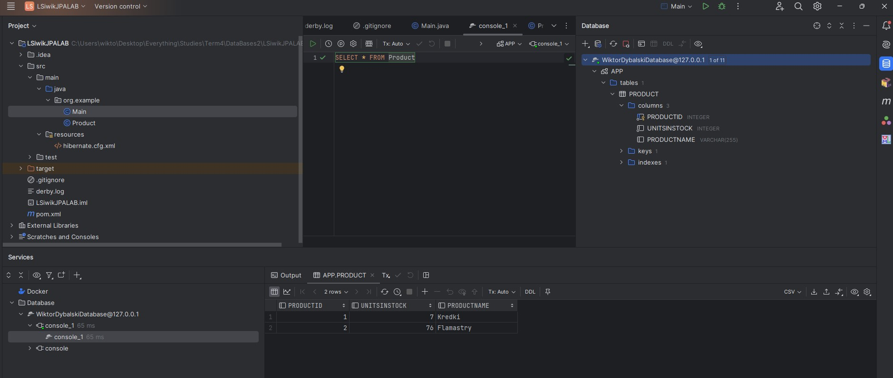
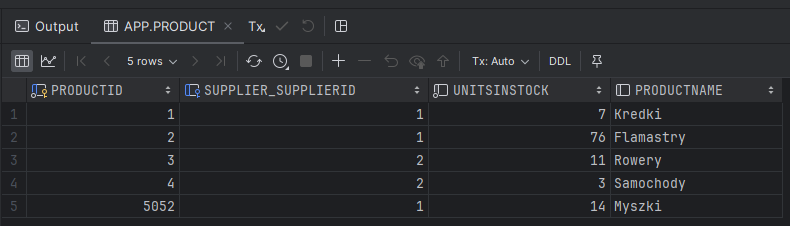
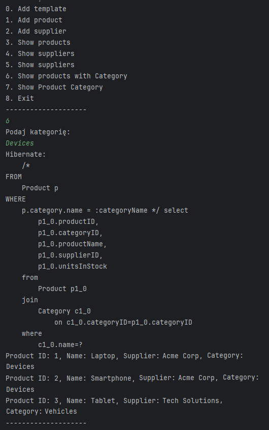
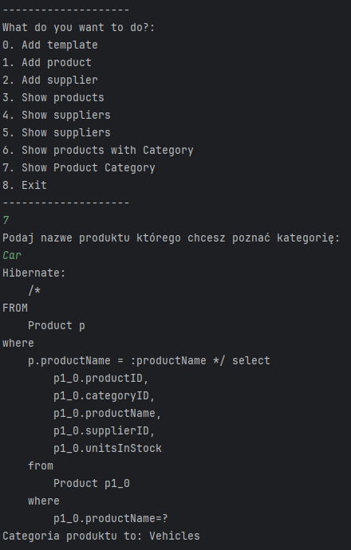
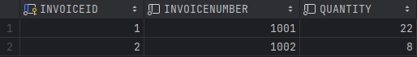
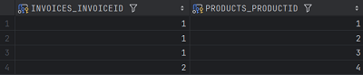
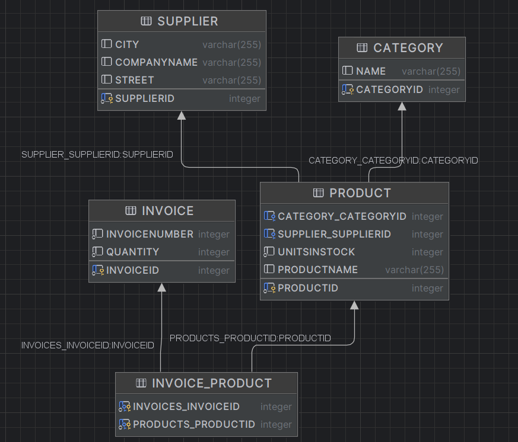

# Hibernate, JPA – laboratorium

ćwiczenie 4


---

**Imiona i nazwiska autorów: Stas Kochevenko & Wiktor Dybalski**

--- 

# Wprowadzenie

W trakcie części "przewodnikowej" została dodana klasa Product. Dodaliśmy przykładowe obiekty tej klasy do bazy danych z wykorzystaniem technologii hibernate’a, a następnie przekonaliśmy się w tym, że są one widoczne w bazie danych.




--- 

# Zadanie 1 - wprowadzenie pojęcia Dostawcy

Zostały dodane podstawowe klasy Product, Supplier oraz Program, baza danych Database.

Kod:

- Product:

```java

@Entity
class Product {

    @Id
    @GeneratedValue(strategy = GenerationType.AUTO)
    private int productID;
    private String productName;
    private int unitsInStock;

    @ManyToOne
    private Supplier supplier;

    public Product() {

    }

    public Product(String productName, int unitsInStock, Supplier supplier) {
        this.productName = productName;
        this.unitsInStock = unitsInStock;
        this.supplier = supplier;
    }
}

```

- Dodane zostały dwie linijki do klasy hibernate.cfg/xml:

```c#
        <mapping class="Supplier"/>
        <mapping class="Product"/>
```

- Supplier:

```java

@Entity
class Supplier {

    @Id
    @GeneratedValue(strategy = GenerationType.AUTO)
    private int supplierID;
    String companyName;
    String street;
    String city;

    public Supplier() {

    }

    public Supplier(String companyName, String street, String city) {
        this.companyName = companyName;
        this.street = street;
        this.city = city;
    }


    public int getSupplierID() {
        return supplierID;
    }

    public String getCompanyName() {
        return companyName;
    }

    public void setCompanyName(String companyName) {
        this.companyName = companyName;
    }

    public String getStreet() {
        return street;
    }

    public void setStreet(String street) {
        this.street = street;
    }

    public String getCity() {
        return city;
    }

    public void setCity(String city) {
        this.city = city;
    }

    @Override
    public String toString() { return companyName; }
}
```

- Main:

```java
class Main {
    private static SessionFactory sessionFactory = null;

    private static SessionFactory getSessionFactory() {
        if (sessionFactory == null) {
            Configuration configuration = new Configuration();
            sessionFactory = configuration.configure().buildSessionFactory();
        }
        return sessionFactory;
    }

    public static void main(String[] args) {

        sessionFactory = getSessionFactory();
        Session session = sessionFactory.openSession();

        Transaction tx;
        Scanner scanner = new Scanner(System.in);
        int option;

        while (true) {
            System.out.println("--------------------");
            System.out.println("What do you want to do?: ");
            System.out.println("1. Add product");
            System.out.println("2. Add supplier");
            System.out.println("3. Show products");
            System.out.println("4. Show suppliers");
            System.out.println("5. Find last added supplier");
            System.out.println("6. Set supplier for product");
            System.out.println("7. Exit");
            System.out.println("--------------------");
            option = scanner.nextInt();
            scanner.nextLine();

            switch (option) {
                case 1:
                    tx = session.beginTransaction();
                    System.out.print("Enter product name: ");
                    String productName = scanner.nextLine();
                    System.out.print("Enter units in stock: ");
                    int unitsInStock = scanner.nextInt();
                    scanner.nextLine();

                    List<Supplier> suppliers = session.createQuery("FROM Supplier", Supplier.class).list();
                    Supplier selectedSupplier;
                    if (suppliers.isEmpty()) {
                        System.out.println("No suppliers found. You need to add a supplier first.");
                        System.out.print("Enter supplier name: ");
                        String newSupplierName = scanner.nextLine();
                        System.out.print("Enter supplier street: ");
                        String newSupplierStreet = scanner.nextLine();
                        System.out.print("Enter supplier city: ");
                        String newSupplierCity = scanner.nextLine();

                        selectedSupplier = new Supplier(newSupplierName, newSupplierStreet, newSupplierCity);
                        session.save(selectedSupplier);
                        System.out.println("New supplier added successfully.");
                    } else {
                        System.out.println("Select a supplier (by ID):");
                        for (Supplier supplier : suppliers) {
                            System.out.println("ID: " + supplier.getSupplierID() + " - Name: " + supplier.getCompanyName());
                        }
                        System.out.print("Enter supplier ID: ");
                        int supplierId = scanner.nextInt();
                        scanner.nextLine();

                        selectedSupplier = session.get(Supplier.class, supplierId);

                        if (selectedSupplier == null) {
                            System.out.println("Invalid supplier ID. Please try again.");
                            break;
                        }
                    }

                    Product product = new Product(productName, unitsInStock, selectedSupplier);
                    session.save(product);
                    tx.commit();
                    System.out.println("Product added successfully.");
                    break;

                case 2:
                    tx = session.beginTransaction();
                    System.out.print("Enter supplier name: ");
                    String supplierName = scanner.nextLine();
                    System.out.print("Enter supplier street: ");
                    String supplierRoad = scanner.nextLine();
                    System.out.print("Enter supplier city: ");
                    String supplierCity = scanner.nextLine();

                    Supplier supplier = new Supplier(supplierName, supplierRoad, supplierCity);
                    session.save(supplier);
                    tx.commit();
                    System.out.println("Supplier added successfully.");
                    break;
                case 3:
                    List<Product> products = session.createQuery("FROM Product", Product.class).list();
                    if (!products.isEmpty()) {
                        for (Product p : products) {
                            System.out.print("Product ID: " + p.getProductID());
                            System.out.print(", Name: " + p.getProductName());
                            System.out.print(", Units in Stock: " + p.getUnitsInStock());
                            System.out.println(", Supplier: " + p.getSupplier().getCompanyName());
                        }
                    } else {
                        System.out.println("No products found.");
                    }
                    break;

                case 4:
                    suppliers = session.createQuery("FROM Supplier", Supplier.class).list();
                    if (!suppliers.isEmpty()) {
                        for (Supplier s : suppliers) {
                            System.out.print("Supplier ID: " + s.getSupplierID());
                            System.out.print(", Name: " + s.getCompanyName());
                            System.out.print(", Street: " + s.getStreet());
                            System.out.println(", City: " + s.getCity());
                        }
                    } else {
                        System.out.println("No suppliers found.");
                    }
                    break;
                case 5:
                    Query<Supplier> query = session.createQuery("FROM Supplier ORDER BY id DESC", Supplier.class);
                    query.setMaxResults(1);
                    Supplier lastSupplier = query.uniqueResult();

                    if (lastSupplier != null) {
                        System.out.print("Last Supplier:");
                        System.out.print(", Name: " + lastSupplier.getCompanyName());
                        System.out.print(", Street: " + lastSupplier.getStreet());
                        System.out.println(", City: " + lastSupplier.getCity());
                    } else {
                        System.out.println("No suppliers found.");
                    }
                    break;
                case 6:
                    Query<Supplier> lastSupQuery = session.createQuery("FROM Supplier ORDER BY id DESC", Supplier.class);
                    lastSupQuery.setMaxResults(1);
                    lastSupplier = lastSupQuery.uniqueResult();

                    Query<Product> lastProdQuery = session.createQuery("FROM Product ORDER BY id DESC", Product.class);
                    lastProdQuery.setMaxResults(1);
                    Product lastProduct = lastProdQuery.uniqueResult();
                    lastProduct.setSupplier(lastSupplier);
                    System.out.println("Setting supplier: " + lastSupplier.getCompanyName() + "for product: " + lastProduct.getProductName());
                    break;
                case 7:
                    session.close();
                    scanner.close();
                    System.out.println("Goodbye!");
                    return;

                default:
                    System.out.println("Invalid option, please try again.");
            }
        }
    }
}
```

Po dodaniu kilku produktów oraz dostawców nasza baza wygląda tak:


Products:


Suppliers:


Sprawdzamy następnie dodanie nowego produktu oraz wyszukanie ostatniego dostawcy:

Dodanie produktu:




Wyszukanie ostatniego dodanego dostawcy:


Ustawienie ostatnio dodanego produktu(id=5052) ostatnio dodanego suppliera:


Natomiast diagram naszej bazy wygląda tak:


Analizując schemat widać, że baza danych poprawnie zoptymalizowała sobie naszą relację Product-Supplier a sam SupplierID
jest kluczem obcym w tabeli Product

--- 

# Zadanie 2 - odwrócenie relacji Supplier -> Product

## a) z tabelą łącznikową:

W klasie main dodano do case przypadek zerowy dodający automatycznie kilka produktów oraz dostwaców:

- Main:

```java
class Main {
    private static SessionFactory sessionFactory = null;

    private static SessionFactory getSessionFactory() {
        if (sessionFactory == null) {
            Configuration configuration = new Configuration();
            sessionFactory = configuration.configure().buildSessionFactory();
        }
        return sessionFactory;
    }

    public static void main(String[] args) {

        sessionFactory = getSessionFactory();
        Session session = sessionFactory.openSession();

        Transaction tx;
        Scanner scanner = new Scanner(System.in);
        int option;

        while (true) {
            System.out.println("--------------------");
            System.out.println("What do you want to do?: ");
            System.out.println("0. Add template");
            System.out.println("1. Add product");
            System.out.println("2. Add supplier");
            System.out.println("3. Show products");
            System.out.println("4. Show suppliers");
            System.out.println("5. Find last added supplier");
            System.out.println("6. Add products to last Supplier");
            System.out.println("7. Exit");
            System.out.println("--------------------");
            option = scanner.nextInt();
            scanner.nextLine();

            switch (option) {
                case 0:
                    tx = session.beginTransaction();

                    Supplier supplier1 = new Supplier("Acme Corp", "123 Main St", "Springfield");
                    Supplier supplier2 = new Supplier("Tech Solutions", "456 Elm St", "Shelbyville");
                    Supplier supplier3 = new Supplier("Global Traders", "789 Oak St", "Capital City");

                    Product product1 = new Product("Laptop", 20);
                    Product product2 = new Product("Smartphone", 50);
                    Product product3 = new Product("Tablet", 30);
                    Product product4 = new Product("Monitor", 15);
                    Product product5 = new Product("Printer", 10);

                    supplier1.addProduct(product1);
                    supplier1.addProduct(product2);

                    supplier2.addProduct(product3);
                    supplier2.addProduct(product4);

                    supplier3.addProduct(product5);

                    session.save(supplier1);
                    session.save(supplier2);
                    session.save(supplier3);

                    session.save(product1);
                    session.save(product2);
                    session.save(product3);
                    session.save(product4);
                    session.save(product5);

                    tx.commit();
                    System.out.println("Product added successfully.");
                    break;
                case 1:
                    tx = session.beginTransaction();
                    System.out.print("Enter product name: ");
                    String productName = scanner.nextLine();
                    System.out.print("Enter units in stock: ");
                    int unitsInStock = scanner.nextInt();
                    Product product = new Product(productName, unitsInStock);
                    session.save(product);
                    tx.commit();
                    System.out.println("Product added successfully.");
                    break;

                case 2:
                    tx = session.beginTransaction();
                    System.out.print("Enter supplier name: ");
                    String supplierName = scanner.nextLine();
                    System.out.print("Enter supplier street: ");
                    String supplierRoad = scanner.nextLine();
                    System.out.print("Enter supplier city: ");
                    String supplierCity = scanner.nextLine();

                    Supplier supplier = new Supplier(supplierName, supplierRoad, supplierCity);
                    session.save(supplier);
                    tx.commit();
                    System.out.println("Supplier added successfully.");
                    break;
                case 3:
                    tx = session.beginTransaction();
                    List<Product> products = session.createQuery("FROM Product", Product.class).list();
                    if (!products.isEmpty()) {
                        for (Product p : products) {
                            System.out.print("Product ID: " + p.getProductID());
                            System.out.print(", Name: " + p.getProductName());
                            System.out.println(", Units in Stock: " + p.getUnitsInStock());
                        }
                    } else {
                        System.out.println("No products found.");
                    }
                    tx.commit();
                    break;

                case 4:
                    tx = session.beginTransaction();
                    List<Supplier> suppliers = session.createQuery("FROM Supplier", Supplier.class).list();
                    if (!suppliers.isEmpty()) {
                        for (Supplier s : suppliers) {
                            System.out.print("Supplier ID: " + s.getSupplierID());
                            System.out.print(", Name: " + s.getCompanyName());
                            System.out.print(", Street: " + s.getStreet());
                            System.out.println(", City: " + s.getCity());
                        }
                    } else {
                        System.out.println("No suppliers found.");
                    }
                    tx.commit();
                    break;
                case 5:
                    Query<Supplier> query = session.createQuery("FROM Supplier ORDER BY id DESC", Supplier.class);
                    query.setMaxResults(1);
                    Supplier lastSupplier = query.uniqueResult();

                    if (lastSupplier != null) {
                        System.out.print("Last Supplier:");
                        System.out.print(", Name: " + lastSupplier.getCompanyName());
                        System.out.print(", Street: " + lastSupplier.getStreet());
                        System.out.println(", City: " + lastSupplier.getCity());
                    } else {
                        System.out.println("No suppliers found.");
                    }
                    break;
                case 6:
                    tx = session.beginTransaction();
                    Query<Supplier> lastSupQuery = session.createQuery("FROM Supplier ORDER BY id DESC", Supplier.class);
                    lastSupQuery.setMaxResults(1);
                    lastSupplier = lastSupQuery.uniqueResult();

                    Query<Product> lastProdQuery = session.createQuery("FROM Product ORDER BY id DESC", Product.class);
                    List<Product> lastProductsList = lastProdQuery.setMaxResults(3).list();

                    for (Product productt : lastProductsList) {
                        lastSupplier.addProduct(productt);
                        System.out.println("Adding product: " + productt.getProductName() + " to supplier: " + lastSupplier.getCompanyName());
                    }
                    tx.commit();
                    System.out.println(lastSupplier.getProducts());
                    break;
                case 7:
                    session.close();
                    scanner.close();
                    System.out.println("Goodbye!");
                    return;

                default:
                    System.out.println("Invalid option, please try again.");
            }
        }
    }
}

```

W dostawcy zmienia się tylko to, że dodajemy listę produktów jakie dostarcza dany dostawca korzystając z tablicy
łącznikowej

- Supplier

```java

@Table(name = "Suppliers")
@Entity
@SequenceGenerator(name = "Supplier_SEQ")
class Supplier {

    @Id
    @GeneratedValue(strategy = GenerationType.SEQUENCE, generator = "Supplier_SEQ")
    private int supplierID;

    private String companyName;
    private String street;
    private String city;

    @OneToMany
    @JoinTable(
            name = "SupplierProducts",
            joinColumns = @JoinColumn(name = "supplierID"),
            inverseJoinColumns = @JoinColumn(name = "productID")
    )
    private List<Product> products = new ArrayList<>();

    public Supplier() {
    }

    Supplier(String companyName, String street, String city) {
        this.companyName = companyName;
        this.street = street;
        this.city = city;
    }

    int getSupplierID() {
        return supplierID;
    }

    String getCompanyName() {
        return companyName;
    }

    String getStreet() {
        return street;
    }

    String getCity() {
        return city;
    }

    List<Product> getProducts() {
        return products;
    }

    void addProduct(Product product) {
        this.products.add(product);
    }

    @Override
    public String toString() { return companyName; }
}


```

W klasie Product zostało usunięte pole Supplier supplier;

Rezultat wykonania case 0:

- Suppliers


- Products


- SupplierProducts


Aktualny schemat bazy:


## b) bez tabeli łącznikowej:

Nie zmienia się nic oprócz klasy Supplier. Tabela lącznikowa została zamieniona na listę produktów.

- Suppliers

```java

@Entity
@SequenceGenerator(name = "Supplier_SEQ")
class Supplier {

    @Id
    @GeneratedValue(strategy = GenerationType.SEQUENCE, generator = "Supplier_SEQ")
    private int supplierID;

    private String companyName;
    private String street;
    private String city;

    @OneToMany()
    private List<Product> products = new ArrayList<>();

    public Supplier() {
    }

    Supplier(String companyName, String street, String city) {
        this.companyName = companyName;
        this.street = street;
        this.city = city;
    }

    int getSupplierID() {
        return supplierID;
    }

    String getCompanyName() {
        return companyName;
    }

    String getStreet() {
        return street;
    }

    String getCity() {
        return city;
    }

    List<Product> getProducts() {
        return products;
    }

    void addProduct(Product product) {
        this.products.add(product);
    }

    @Override
    public String toString() { return companyName; }
}
```

Baza danych optymalizuje sobie połączenie pomiędzy tabelami i przedstawia ją w taki sam sposób jak w przypadku
relacji z zadania 1.

Aktualny schemat bazy:


--- 

# Zadanie 3 - dwustronna relacja Supplier <----> Product

Łączymy poprzednie rozwiązania, czyli w klasie Product będzie się znajdować ID Suppliera, który dostarcza ten produkt, a każdy Supplier będzie miał listę tych produktów, które dostarcza. 

- Zmiana w klasie Product:

```java

@ManyToOne
@JoinColumn(name = "supplierID")
private Supplier supplier;
```

- Zmiana w klasie Supplier:

```java

@OneToMany(mappedBy = "supplier")
private List<Product> products = new ArrayList<>();
```

W case 0 w klasie Main dodaliśmy podwójną relację.

- Zmiana w klasie Main:

```java
case 0:
tx =session.

beginTransaction();

Supplier supplier1 = new Supplier("Acme Corp", "123 Main St", "Springfield");
Supplier supplier2 = new Supplier("Tech Solutions", "456 Elm St", "Shelbyville");
Supplier supplier3 = new Supplier("Global Traders", "789 Oak St", "Capital City");

Product product1 = new Product("Laptop", 20);
Product product2 = new Product("Smartphone", 50);
Product product3 = new Product("Tablet", 30);
Product product4 = new Product("Monitor", 15);
Product product5 = new Product("Printer", 10);

product1.setSupplier(supplier1);
product2.setSupplier(supplier1);
roduct3.setSupplier(supplier2);
product4.setSupplier(supplier2);
product5.setSupplier(supplier3);

supplier1.addProduct(product1);
supplier1.addProduct(product2);
supplier2.addProduct(product3);
supplier2.addProduct(product4);
supplier3.addProduct(product5);

session.save(supplier1);
session.save(supplier2);
session.save(supplier3);
session.save(product1);
session.save(product2);
session.save(product3);
session.save(product4);
session.save(product5);

tx.commit();
System.out.println("Product added successfully.");

break;
```

- SQL logi po wykonaniu kroku 0:
--------------------
What do you want to do?:

0. Add template
1. Add product
2. Add supplier
3. Show products
4. Show suppliers
5. Find last added supplier
6. Add products to last Supplier
7. Exit

--------------------
0

Hibernate:

```sql    

values
    next value for Supplier_SEQ
    Hibernate:

values
    next value for Supplier_SEQ
    Hibernate:

values
    next value for Products_SEQ
    Hibernate:

values
    next value for Products_SEQ
    Hibernate:
/* insert for
    zad1.Supplier */insert
into
    Supplier (city, companyName, street, supplierID)
values
    (?, ?, ?, ?)
    Hibernate:
/* insert for
    zad1.Supplier */insert
into
    Supplier (city, companyName, street, supplierID)
values
    (?, ?, ?, ?)
    Hibernate:
/* insert for
    zad1.Supplier */insert
into
    Supplier (city, companyName, street, supplierID)
values
    (?, ?, ?, ?)
    Hibernate:
/* insert for
    zad1.Product */insert
into
    Product (productName, supplierID, unitsInStock, productID)
values
    (?, ?, ?, ?)
    Hibernate:
/* insert for
    zad1.Product */insert
into
    Product (productName, supplierID, unitsInStock, productID)
values
    (?, ?, ?, ?)
    Hibernate:
/* insert for
    zad1.Product */insert
into
    Product (productName, supplierID, unitsInStock, productID)
values
    (?, ?, ?, ?)
    Hibernate:
/* insert for
    zad1.Product */insert
into
    Product (productName, supplierID, unitsInStock, productID)
values
    (?, ?, ?, ?)
    Hibernate:
/* insert for
    zad1.Product */insert
into
    Product (productName, supplierID, unitsInStock, productID)
values
    (?, ?, ?, ?)
    Product added successfully.
```

Products:


Suppliers:


Zoptymalizowany schemat bazy danych:


Jak widać baza danych znowu zoptymalizowała sobie relacje pomiędzy tabelami, podobnie jak to było w Entity Framework.

---

# Zadanie 4 - dodanie kategorii produktu

Została stworzona relacja identyczna jak dla Suppliera czyli one-to-many

- Do klasy Product dodano:

```java
    @ManyToOne
    @JoinColumn(name = "categoryID")
    private Category category;

...
public void setCategory(Category category) {
    this.category = category;
}
```

- Category:

```java
@Entity
@SequenceGenerator(name = "Categories_SEQ")
class Category {

    @Id
    @GeneratedValue(strategy = GenerationType.AUTO, generator = "Categories_SEQ")
    int categoryID;
    String name;

    @OneToMany(mappedBy = "category")
    List<Product> products = new ArrayList<>();

    public Category() {
    }

    public Category(String name) {
        this.name = name;
    }

    public int getCategoryID() {
        return categoryID;
    }

    public String getName() {
        return name;
    }

    public List<Product> getProducts() {
        return products;
    }

    public void addProducts(Product product) {
        products.add(product);
    }

    @Override
    public String toString() { return name; }
}

```

- Main po modyfikacji:

```java
class Main {
    private static SessionFactory sessionFactory = null;

    private static SessionFactory getSessionFactory() {
        if (sessionFactory == null) {
            Configuration configuration = new Configuration();
            sessionFactory = configuration.configure().buildSessionFactory();
        }
        return sessionFactory;
    }

    public static void main(String[] args) {

        sessionFactory = getSessionFactory();
        Session session = sessionFactory.openSession();

        Transaction tx;
        Scanner scanner = new Scanner(System.in);
        int option;

        while (true) {
            System.out.println("--------------------");
            System.out.println("What do you want to do?: ");
            System.out.println("0. Add template");
            System.out.println("1. Add product");
            System.out.println("2. Add supplier");
            System.out.println("3. Show products");
            System.out.println("4. Show suppliers");
            System.out.println("5. Show suppliers");
            System.out.println("6. Show products with Category");
            System.out.println("7. Show Product Category");
            System.out.println("8. Exit");
            System.out.println("--------------------");
            option = scanner.nextInt();
            scanner.nextLine();

            switch (option) {
                case 0:
                    tx = session.beginTransaction();

                    Supplier supplier1 = new Supplier("Acme Corp", "123 Main St", "Springfield");
                    Supplier supplier2 = new Supplier("Tech Solutions", "456 Elm St", "Shelbyville");
                    Supplier supplier3 = new Supplier("Global Traders", "789 Oak St", "Capital City");

                    Product product1 = new Product("Laptop", 20);
                    Product product2 = new Product("Smartphone", 50);
                    Product product3 = new Product("Tablet", 30);
                    Product product4 = new Product("Books", 15);
                    Product product5 = new Product("Car", 10);

                    Category category1 = new Category("Devices");
                    Category category2 = new Category("School");
                    Category category3 = new Category("Vehicles");

                    product1.setSupplier(supplier1);
                    product1.setCategory(category1);

                    product2.setSupplier(supplier1);
                    product2.setCategory(category1);

                    product3.setSupplier(supplier2);
                    product3.setCategory(category1);

                    product4.setSupplier(supplier2);
                    product4.setCategory(category2);

                    product5.setSupplier(supplier3);
                    product5.setCategory(category3);


                    supplier1.addProduct(product1);
                    supplier1.addProduct(product2);

                    supplier2.addProduct(product3);
                    supplier2.addProduct(product4);

                    supplier3.addProduct(product5);

                    category1.addProducts(product1);
                    category1.addProducts(product2);
                    category1.addProducts(product3);

                    category2.addProducts(product4);

                    category3.addProducts(product5);


                    session.save(supplier1);
                    session.save(supplier2);
                    session.save(supplier3);

                    session.save(category1);
                    session.save(category2);
                    session.save(category3);

                    session.save(product1);
                    session.save(product2);
                    session.save(product3);
                    session.save(product4);
                    session.save(product5);

                    tx.commit();
                    System.out.println("Product added successfully.");
                    break;
                case 1:
                    tx = session.beginTransaction();
                    System.out.print("Enter product name: ");
                    String productName = scanner.nextLine();
                    System.out.print("Enter units in stock: ");
                    int unitsInStock = scanner.nextInt();
                    Product product = new Product(productName, unitsInStock);
                    session.save(product);
                    tx.commit();
                    System.out.println("Product added successfully.");
                    break;

                case 2:
                    tx = session.beginTransaction();
                    System.out.print("Enter supplier name: ");
                    String supplierName = scanner.nextLine();
                    System.out.print("Enter supplier street: ");
                    String supplierRoad = scanner.nextLine();
                    System.out.print("Enter supplier city: ");
                    String supplierCity = scanner.nextLine();

                    Supplier supplier = new Supplier(supplierName, supplierRoad, supplierCity);
                    session.save(supplier);
                    tx.commit();
                    System.out.println("Supplier added successfully.");
                    break;
                case 3:
                    tx = session.beginTransaction();
                    List<Product> products = session.createQuery("FROM Product", Product.class).list();
                    if (!products.isEmpty()) {
                        for (Product p : products) {
                            System.out.print("Product ID: " + p.getProductID());
                            System.out.print(", Name: " + p.getProductName());
                            System.out.println(", Supplier: " + p.getSupplier());
                            System.out.println(", Category: " + p.getCategory());
                        }
                    } else {
                        System.out.println("No products found.");
                    }
                    tx.commit();
                    break;

                case 4:
                    tx = session.beginTransaction();
                    List<Supplier> suppliers = session.createQuery("FROM Supplier", Supplier.class).list();
                    if (!suppliers.isEmpty()) {
                        for (Supplier s : suppliers) {
                            System.out.print("Supplier ID: " + s.getSupplierID());
                            System.out.print(", Name: " + s.getCompanyName());
                            System.out.print(", Street: " + s.getStreet());
                            System.out.println(", City: " + s.getCity());
                            System.out.println("Products: " + s.getProducts());
                        }
                    } else {
                        System.out.println("No suppliers found.");
                    }
                    tx.commit();
                    break;
                case 5:
                    tx = session.beginTransaction();
                    List<Category> categories = session.createQuery("FROM Category ", Category.class).list();
                    if (!categories.isEmpty()) {
                        for (Category c : categories) {
                            System.out.print("Category ID: " + c.getCategoryID());
                            System.out.print(", Name: " + c.getName());
                            System.out.println(", Products: " + c.getProducts());
                        }
                    } else {
                        System.out.println("No categories found.");
                    }
                    tx.commit();
                    break;
                case 6:
                    tx = session.beginTransaction();
                    System.out.println("Podaj kategorię: ");
                    String categoryName = scanner.nextLine();
                    List<Product> filteredProducts = session.createQuery("FROM Product p WHERE p.category.name = :categoryName", Product.class).setParameter("categoryName", categoryName).list();
                    if (!filteredProducts.isEmpty()) {
                        for (Product p : filteredProducts) {
                            System.out.print("Product ID: " + p.getProductID());
                            System.out.print(", Name: " + p.getProductName());
                            System.out.println(", Supplier: " + p.getSupplier().getName());
                            System.out.println(", Category: " + p.getCategory().getName());
                        }
                    } else {
                        System.out.println("No products found.");
                    }
                    tx.commit();
                    break;
                case 7:
                    tx = session.beginTransaction();
                    System.out.println("Podaj nazwe produktu którego chcesz poznać kategorię: ");
                    productName = scanner.nextLine();
                    Product specificProduct = session.createQuery("FROM Product p where p.productName = :productName", Product.class).setParameter("productName", productName).uniqueResult();
                    if (specificProduct == null) {
                        System.out.println("Produkt nie znaleziony");
                    }
                    Category category = specificProduct.getCategory();
                    if (category == null) {
                        System.out.println("Kategoria nie znaleziona");
                    } else {
                        System.out.println("Categoria produktu to: " + category.getName());
                    }
                    tx.commit();
                    break;
                case 8:
                    session.close();
                    scanner.close();
                    System.out.println("Goodbye!");
                    return;

                default:
                    System.out.println("Invalid option, please try again.");
            }
        }
    }
}
```
Products:


Categories:


- SQL Logi po wykonaniu z main case 0:

```sql
Hibernate: 
    
values
    next value for Supplier_SEQ
Hibernate: 
    
values
    next value for Supplier_SEQ
Hibernate: 
    
values
    next value for Categories_SEQ
Hibernate: 
    
values
    next value for Categories_SEQ
Hibernate: 
    
values
    next value for Products_SEQ
Hibernate: 
    
values
    next value for Products_SEQ
Hibernate: 
    /* insert for
        zad1.Supplier */insert 
    into
        Supplier (city, companyName, street, supplierID) 
    values
        (?, ?, ?, ?)
Hibernate: 
    /* insert for
        zad1.Supplier */insert 
    into
        Supplier (city, companyName, street, supplierID) 
    values
        (?, ?, ?, ?)
Hibernate: 
    /* insert for
        zad1.Supplier */insert 
    into
        Supplier (city, companyName, street, supplierID) 
    values
        (?, ?, ?, ?)
Hibernate: 
    /* insert for
        zad1.Category */insert 
    into
        Category (name, categoryID) 
    values
        (?, ?)
Hibernate: 
    /* insert for
        zad1.Category */insert 
    into
        Category (name, categoryID) 
    values
        (?, ?)
Hibernate: 
    /* insert for
        zad1.Category */insert 
    into
        Category (name, categoryID) 
    values
        (?, ?)
Hibernate: 
    /* insert for
        zad1.Product */insert 
    into
        Product (categoryID, productName, supplierID, unitsInStock, productID) 
    values
        (?, ?, ?, ?, ?)
Hibernate: 
    /* insert for
        zad1.Product */insert 
    into
        Product (categoryID, productName, supplierID, unitsInStock, productID) 
    values
        (?, ?, ?, ?, ?)
Hibernate: 
    /* insert for
        zad1.Product */insert 
    into
        Product (categoryID, productName, supplierID, unitsInStock, productID) 
    values
        (?, ?, ?, ?, ?)
Hibernate: 
    /* insert for
        zad1.Product */insert 
    into
        Product (categoryID, productName, supplierID, unitsInStock, productID) 
    values
        (?, ?, ?, ?, ?)
Hibernate: 
    /* insert for
        zad1.Product */insert 
    into
        Product (categoryID, productName, supplierID, unitsInStock, productID) 
    values
        (?, ?, ?, ?, ?)
Product added successfully.    
```

Produkty z wybranej kategorii:



Kategoria danego produktu:



Zoptymalizowany schemat bazy danych:


---

# Zadanie 5 - modelowanie relacji wiele-do-wielu

 - Tworzymy klasę Invoice reprezentującą fakturę konkretnego zamówienia, a następnie ustawiamy realcję wiele do wielu z tabelą Products. 
 - Modelujemy relacje dodając do klasy Products HashSet z adnotacją ManyToMany reprezentujący w jakich fakturach znajduje się dany produkt

- Product:

```java
@Entity
@SequenceGenerator(name = "Products_SEQ")
class Product{

    @Id
    @GeneratedValue(strategy = GenerationType.SEQUENCE, generator = "Products_SEQ")
    private int productID;

    private String productName;
    private int unitsInStock;

    @ManyToOne
    @JoinColumn(name = "supplierID")
    private Supplier supplier;

    @ManyToOne
    @JoinColumn(name = "categoryID")
    private Category category;

    @ManyToMany(mappedBy = "products")
    private Set<Invoice> invoices = new HashSet<>();

    public Product() {}

    Product(String productName, int unitsInStock) {
        this.productName = productName;
        this.unitsInStock = unitsInStock;
    }

    int getProductID() {
        return productID;
    }

    String getProductName() {
        return productName;
    }

    int getUnitsInStock() {
        return unitsInStock;
    }

    public Supplier getSupplier() {
        return supplier;
    }

    public void setSupplier(Supplier supplier) {
        this.supplier = supplier;
    }

    public void setCategory(Category category) {
        this.category = category;
    }

    public Category getCategory() {
        return category;
    }

    @Override
    public String toString() {
        return "Product{" +
                "productName='" + productName + '\'' +
                '}';
    }

    public Set<Invoice> getInvoices() {
        return invoices;
    }

    public void sell(Invoice invoice, int quantity) {
        if (unitsInStock < quantity) {
            System.out.println("Unable to sell" + quantity + " products");
            return;
        }
        unitsInStock -= quantity;
        invoice.addProducts(this, quantity);
        invoices.add(invoice);
    }
}
```


Z kolei w klasie Invoice tworzymy HashSet z adnotacjami ManyToMany oraz JoinTable aby baza danych poprawnie powiązała relację ManyToMany tworząc pomocniczą tabelę Invoice_Products (jest to łącznik pomiędzy dwoma tabelami, który w relacjach ManyToMany jest niezbędny) 


- Invoice

```java
@Entity
@SequenceGenerator(name = "Invoice_SEQ")
public class Invoice {

    @Id
    @GeneratedValue(strategy = GenerationType.AUTO, generator = "Invoice_SEQ")
    private int invoiceID;
    private int invoiceNumber;
    private int quantity = 0;

    @ManyToMany
    @JoinTable(
            name = "Invoice_Products",
            joinColumns = @JoinColumn(name = "invoiceID"),
            inverseJoinColumns = @JoinColumn(name = "productID")
    )
    private Set<Product> products = new HashSet<>();

    public Invoice() {
    }

    public Invoice(int invoiceNumber) {
        this.invoiceNumber = invoiceNumber;
    }

    public Set<Product> getProducts() {
        return products;
    }

    public void addProducts(Product product, int quantity) {
        products.add(product);
        this.quantity += quantity;
    }

    public int getInvoiceNumber() {
        return invoiceNumber;
    }

    public int getQuantity() {
        return quantity;
    }

    @Override
    public String toString() {
        return "Invoice{" +
                "invoiceNumber=" + invoiceNumber +
                '}';
    }
}
```

W klasie main dodaliśmy kilka Invoices, w ramach których zostałe sprzedane produkty.

- Main

```java
class Main {
private static SessionFactory sessionFactory = null;

    private static SessionFactory getSessionFactory() {
        if (sessionFactory == null) {
            Configuration configuration = new Configuration();
            sessionFactory = configuration.configure().buildSessionFactory();
        }
        return sessionFactory;
    }

    public static void main(String[] args) {

        sessionFactory = getSessionFactory();
        Session session = sessionFactory.openSession();

        Transaction tx;
        Scanner scanner = new Scanner(System.in);
        int option;

        while (true) {
            System.out.println("--------------------");
            System.out.println("What do you want to do?: ");
            System.out.println("0. Add template");
            System.out.println("1. Add product");
            System.out.println("2. Add supplier");
            System.out.println("3. Show products");
            System.out.println("4. Show suppliers");
            System.out.println("5. Show category");
            System.out.println("6. Show products with Category");
            System.out.println("7. Show Sold products on InvoiceID: ");
            System.out.println("8. Show Invoices that product had been sold: ");
            System.out.println("9. Show Product Category");
            System.out.println("10. Exit");
            System.out.println("--------------------");
            option = scanner.nextInt();
            scanner.nextLine();

            switch (option) {
                case 0:
                    tx = session.beginTransaction();

                    Supplier supplier1 = new Supplier("Acme Corp", "123 Main St", "Springfield");
                    Supplier supplier2 = new Supplier("Tech Solutions", "456 Elm St", "Shelbyville");
                    Supplier supplier3 = new Supplier("Global Traders", "789 Oak St", "Capital City");

                    Product product1 = new Product("Laptop", 20);
                    Product product2 = new Product("Smartphone", 50);
                    Product product3 = new Product("Tablet", 30);
                    Product product4 = new Product("Books", 15);
                    Product product5 = new Product("Car", 10);

                    Category category1 = new Category("Devices");
                    Category category2 = new Category("School");
                    Category category3 = new Category("Vehicles");

                    Invoice invoice1 = new Invoice(1001);
                    Invoice invoice2 = new Invoice(1002);
                    int soldNumber1 = 4;
                    int soldNumber2 = 6;
                    int soldNumber3 = 8;

                    product1.sell(invoice1, soldNumber1);
                    product2.sell(invoice1, soldNumber2);
                    product3.sell(invoice1, soldNumber3);
                    product4.sell(invoice2, soldNumber3);
                    product3.sell(invoice1, soldNumber1);


                    product1.setSupplier(supplier1);
                    product1.setCategory(category1);

                    product2.setSupplier(supplier1);
                    product2.setCategory(category1);

                    product3.setSupplier(supplier2);
                    product3.setCategory(category1);

                    product4.setSupplier(supplier2);
                    product4.setCategory(category2);

                    product5.setSupplier(supplier3);
                    product5.setCategory(category3);


                    supplier1.addProduct(product1);
                    supplier1.addProduct(product2);

                    supplier2.addProduct(product3);
                    supplier2.addProduct(product4);

                    supplier3.addProduct(product5);

                    category1.addProducts(product1);
                    category1.addProducts(product2);
                    category1.addProducts(product3);

                    category2.addProducts(product4);

                    category3.addProducts(product5);

                    session.save(supplier1);
                    session.save(supplier2);
                    session.save(supplier3);

                    session.save(category1);
                    session.save(category2);
                    session.save(category3);

                    session.save(product1);
                    session.save(product2);
                    session.save(product3);
                    session.save(product4);
                    session.save(product5);

                    session.save(invoice1);
                    session.save(invoice2);


                    tx.commit();
                    System.out.println("Product added successfully.");
                    break;
                case 1:
                    tx = session.beginTransaction();
                    System.out.print("Enter product name: ");
                    String productName = scanner.nextLine();
                    System.out.print("Enter units in stock: ");
                    int unitsInStock = scanner.nextInt();
                    Product product = new Product(productName, unitsInStock);
                    session.save(product);
                    tx.commit();
                    System.out.println("Product added successfully.");
                    break;

                case 2:
                    tx = session.beginTransaction();
                    System.out.print("Enter supplier name: ");
                    String supplierName = scanner.nextLine();
                    System.out.print("Enter supplier street: ");
                    String supplierRoad = scanner.nextLine();
                    System.out.print("Enter supplier city: ");
                    String supplierCity = scanner.nextLine();

                    Supplier supplier = new Supplier(supplierName, supplierRoad, supplierCity);
                    session.save(supplier);
                    tx.commit();
                    System.out.println("Supplier added successfully.");
                    break;
                case 3:
                    tx = session.beginTransaction();
                    List<Product> products = session.createQuery("FROM Product", Product.class).list();
                    if (!products.isEmpty()) {
                        for (Product p : products) {
                            System.out.print("Product ID: " + p.getProductID());
                            System.out.print(", Name: " + p.getProductName());
                            System.out.println(", Supplier: " + p.getSupplier());
                            System.out.println(", Category: " + p.getCategory());
                            System.out.println(", Invoices: " + p.getInvoices());
                        }
                    } else {
                        System.out.println("No products found.");
                    }
                    tx.commit();
                    break;

                case 4:
                    tx = session.beginTransaction();
                    List<Supplier> suppliers = session.createQuery("FROM Supplier", Supplier.class).list();
                    if (!suppliers.isEmpty()) {
                        for (Supplier s : suppliers) {
                            System.out.print("Supplier ID: " + s.getSupplierID());
                            System.out.print(", Name: " + s.getCompanyName());
                            System.out.print(", Street: " + s.getStreet());
                            System.out.println(", City: " + s.getCity());
                            System.out.println("Products: " + s.getProducts());
                        }
                    } else {
                        System.out.println("No suppliers found.");
                    }
                    tx.commit();
                    break;
                case 5:
                    tx = session.beginTransaction();
                    List<Category> categories = session.createQuery("FROM Category ", Category.class).list();
                    if (!categories.isEmpty()) {
                        for (Category c : categories) {
                            System.out.print("Category ID: " + c.getCategoryID());
                            System.out.print(", Name: " + c.getName());
                            System.out.println(", Products: " + c.getProducts());
                        }
                    } else {
                        System.out.println("No categories found.");
                    }
                    tx.commit();
                    break;
                case 6:
                    tx = session.beginTransaction();
                    System.out.println("Category Name: ");
                    String categoryName = scanner.nextLine();
                    List<Product> filteredProducts = session.createQuery("FROM Product p WHERE p.category.name = :categoryName", Product.class).setParameter("categoryName", categoryName).list();
                    if (!filteredProducts.isEmpty()) {
                        for (Product p : filteredProducts) {
                            System.out.print("Product ID: " + p.getProductID());
                            System.out.print(", Name: " + p.getProductName());
                            System.out.println(", Supplier: " + p.getSupplier());
                            System.out.println(", Category: " + p.getCategory());
                        }
                    } else {
                        System.out.println("No products found.");
                    }
                    tx.commit();
                    break;
                case 7:
                    tx = session.beginTransaction();
                    System.out.println("Invoice Number: ");
                    String invoiceNumber = scanner.nextLine();
                    Invoice invoice = session.createQuery("FROM Invoice inv where inv.invoiceNumber = :invoiceNumber", Invoice.class).setParameter("invoiceNumber", invoiceNumber).uniqueResult();
                    if (invoice != null) {
                        for (Product p : invoice.getProducts()) {
                            System.out.print("ProductID: " + p.getProductID());
                            System.out.print(", Name: " + p.getProductName());
                            System.out.print(", Supplier: " + p.getSupplier());
                            System.out.println(", Category: " + p.getCategory());
                        }
                    } else {
                        System.out.println("No invoice found.");
                    }
                    tx.commit();
                    break;
                case 8:
                    tx = session.beginTransaction();
                    System.out.println("Product Name: ");
                    productName = scanner.nextLine();
                    products = session.createQuery("FROM Product p WHERE p.productName = :productName", Product.class)
                            .setParameter("productName", productName)
                            .getResultList();
                    if (!products.isEmpty()) {
                        for (Product p : products) {
                            System.out.println("Product: " + p.getProductName() + " appears in the following invoices:");
                            for (Invoice inv : p.getInvoices()) {
                                System.out.println("Invoice Number: " + inv.getInvoiceNumber());
                            }
                        }
                    } else {
                        System.out.println("No products found.");
                    }
                    tx.commit();
                    break;
                case 9:
                    tx = session.beginTransaction();
                    System.out.println("Product name you want to know category: ");
                    productName = scanner.nextLine();
                    Product specificProduct = session.createQuery("FROM Product p where p.productName = :productName", Product.class).setParameter("productName", productName).uniqueResult();
                    if (specificProduct == null) {
                        System.out.println("Product not found");
                    }
                    Category category = specificProduct.getCategory();
                    if (category == null) {
                        System.out.println("Category not found");
                    } else {
                        System.out.println("Product Category: : " + category.getName());
                    }
                    tx.commit();
                    break;
                case 10:
                    session.close();
                    scanner.close();
                    System.out.println("Goodbye!");
                    return;

                default:
                    System.out.println("Invalid option, please try again.");
            }
        }
    }
}
```

- SQL Logi:

```sql
Hibernate: 
    
values
    next value for Supplier_SEQ
Hibernate: 
    
values
    next value for Supplier_SEQ
Hibernate: 
    
values
    next value for Categories_SEQ
Hibernate: 
    
values
    next value for Categories_SEQ
Hibernate: 
    
values
    next value for Products_SEQ
Hibernate: 
    
values
    next value for Products_SEQ
Hibernate: 
    
values
    next value for Invoice_SEQ
Hibernate: 
    
values
    next value for Invoice_SEQ
Hibernate: 
    /* insert for
        zad1.Supplier */insert 
    into
        Supplier (city, companyName, street, supplierID) 
    values
        (?, ?, ?, ?)
Hibernate: 
    /* insert for
        zad1.Supplier */insert 
    into
        Supplier (city, companyName, street, supplierID) 
    values
        (?, ?, ?, ?)
Hibernate: 
    /* insert for
        zad1.Supplier */insert 
    into
        Supplier (city, companyName, street, supplierID) 
    values
        (?, ?, ?, ?)
Hibernate: 
    /* insert for
        zad1.Category */insert 
    into
        Category (name, categoryID) 
    values
        (?, ?)
Hibernate: 
    /* insert for
        zad1.Category */insert 
    into
        Category (name, categoryID) 
    values
        (?, ?)
Hibernate: 
    /* insert for
        zad1.Category */insert 
    into
        Category (name, categoryID) 
    values
        (?, ?)
Hibernate: 
    /* insert for
        zad1.Product */insert 
    into
        Product (categoryID, productName, supplierID, unitsInStock, productID) 
    values
        (?, ?, ?, ?, ?)
Hibernate: 
    /* insert for
        zad1.Product */insert 
    into
        Product (categoryID, productName, supplierID, unitsInStock, productID) 
    values
        (?, ?, ?, ?, ?)
Hibernate: 
    /* insert for
        zad1.Product */insert 
    into
        Product (categoryID, productName, supplierID, unitsInStock, productID) 
    values
        (?, ?, ?, ?, ?)
Hibernate: 
    /* insert for
        zad1.Product */insert 
    into
        Product (categoryID, productName, supplierID, unitsInStock, productID) 
    values
        (?, ?, ?, ?, ?)
Hibernate: 
    /* insert for
        zad1.Product */insert 
    into
        Product (categoryID, productName, supplierID, unitsInStock, productID) 
    values
        (?, ?, ?, ?, ?)
Hibernate: 
    /* insert for
        zad1.Invoice */insert 
    into
        Invoice (invoiceNumber, quantity, invoiceID) 
    values
        (?, ?, ?)
Hibernate: 
    /* insert for
        zad1.Invoice */insert 
    into
        Invoice (invoiceNumber, quantity, invoiceID) 
    values
        (?, ?, ?)
Hibernate: 
    /* insert for
        zad1.Invoice.products */insert 
    into
        Invoice_Products (invoiceID, productID) 
    values
        (?, ?)
Hibernate: 
    /* insert for
        zad1.Invoice.products */insert 
    into
        Invoice_Products (invoiceID, productID) 
    values
        (?, ?)
Hibernate: 
    /* insert for
        zad1.Invoice.products */insert 
    into
        Invoice_Products (invoiceID, productID) 
    values
        (?, ?)
Hibernate: 
    /* insert for
        zad1.Invoice.products */insert 
    into
        Invoice_Products (invoiceID, productID) 
    values
        (?, ?)
Product added successfully.
```

Products:


Invoices:



InvoiceProducts:


Produkty na fakturze o konkretnym numerze:


Faktury na których został sprzedany dany produkt:


Schemat bazy danych:


---

# Zadanie 6 - modelowanie relacji wiele-do-wielu: JPA

Stworzyliśmy nowego Maina i nieco zmieniliśmy kod poszczególnych klas i konfiguracji, aby mogły one współpracować z technologią JPA. Klasy Category oraz Supplier pozostają bez zmian.

- Invoice (fragment starego kodu)

```java
...
    @ManyToMany
    @JoinTable(
            name = "Invoice_Products",
            joinColumns = @JoinColumn(name = "invoiceID"),
            inverseJoinColumns = @JoinColumn(name = "productID")
    )
    private Set<Product> products = new HashSet<>();
...
```

- Inovice (fragment nowego kodu)

```java
...
    @ManyToMany(cascade = CascadeType.PERSIST)
    private Set<Product> products = new HashSet<>();
...
```

- Product (fragment starego kodu)

```java
...
    @ManyToOne
    @JoinColumn(name = "supplierID")
    private Supplier supplier;

    @ManyToOne
    @JoinColumn(name = "categoryID")
    private Category category;

    @ManyToMany(mappedBy = "products")
    private Set<Invoice> invoices = new HashSet<>();
...
```

- Product (fragment nowego kodu)

```java
    @ManyToOne(cascade = CascadeType.PERSIST)
    private Supplier supplier;

    @ManyToOne(cascade = CascadeType.PERSIST)
    private Category category;

    @ManyToMany(mappedBy = "products")
    private Set<Invoice> invoices = new HashSet<>();
```

- MainJPA

```java
package zad1;

import jakarta.persistence.EntityManager;
import jakarta.persistence.EntityManagerFactory;
import jakarta.persistence.EntityTransaction;
import jakarta.persistence.Persistence;
import org.hibernate.Transaction;
import org.hibernate.cfg.Configuration;

import java.util.List;
import java.util.Scanner;
import java.util.Set;


class MainJPA {
    private static final EntityManagerFactory emf;

    static {
        try {
            emf = Persistence.createEntityManagerFactory("derby");
        } catch (Throwable ex) {
            throw new ExceptionInInitializerError(ex);
        }
    }
    public static EntityManager getEntityManager() {
        return emf.createEntityManager();
    }

    public static void main(String[] args) {
        final EntityManager entityManager = getEntityManager();
        EntityTransaction tx;

        Scanner scanner = new Scanner(System.in);
        int option;

        while (true) {
            System.out.println("--------------------");
            System.out.println("What do you want to do?: ");
            System.out.println("0. Add template");
            System.out.println("1. Add product");
            System.out.println("2. Add supplier");
            System.out.println("3. Show products");
            System.out.println("4. Show suppliers");
            System.out.println("5. Show category");
            System.out.println("6. Show products with Category");
            System.out.println("7. Show Sold products on InvoiceID: ");
            System.out.println("8. Show Invoices that product had been sold: ");
            System.out.println("9. Show Product Category");
            System.out.println("10. Exit");
            System.out.println("--------------------");
            option = scanner.nextInt();
            scanner.nextLine();

            switch (option) {
                case 0:
                    tx = entityManager.getTransaction();
                    tx.begin();

                    Supplier supplier1 = new Supplier("Acme Corp", "123 Main St", "Springfield");
                    Supplier supplier2 = new Supplier("Tech Solutions", "456 Elm St", "Shelbyville");
                    Supplier supplier3 = new Supplier("Global Traders", "789 Oak St", "Capital City");

                    Product product1 = new Product("Laptop", 20);
                    Product product2 = new Product("Smartphone", 50);
                    Product product3 = new Product("Tablet", 30);
                    Product product4 = new Product("Books", 15);
                    Product product5 = new Product("Car", 10);

                    Category category1 = new Category("Devices");
                    Category category2 = new Category("School");
                    Category category3 = new Category("Vehicles");

                    Invoice invoice1 = new Invoice(1001);
                    Invoice invoice2 = new Invoice(1002);
                    int soldNumber1 = 4;
                    int soldNumber2 = 6;
                    int soldNumber3 = 8;

                    product1.sell(invoice1, soldNumber1);
                    product2.sell(invoice1, soldNumber2);
                    product3.sell(invoice1, soldNumber3);
                    product4.sell(invoice2, soldNumber3);
                    product3.sell(invoice1, soldNumber1);


                    product1.setSupplier(supplier1);
                    product1.setCategory(category1);

                    product2.setSupplier(supplier1);
                    product2.setCategory(category1);

                    product3.setSupplier(supplier2);
                    product3.setCategory(category1);

                    product4.setSupplier(supplier2);
                    product4.setCategory(category2);

                    product5.setSupplier(supplier3);
                    product5.setCategory(category3);


                    supplier1.addProduct(product1);
                    supplier1.addProduct(product2);

                    supplier2.addProduct(product3);
                    supplier2.addProduct(product4);

                    supplier3.addProduct(product5);

                    category1.addProducts(product1);
                    category1.addProducts(product2);
                    category1.addProducts(product3);

                    category2.addProducts(product4);

                    category3.addProducts(product5);

                    entityManager.persist(supplier1);
                    entityManager.persist(supplier2);
                    entityManager.persist(supplier3);

                    entityManager.persist(category1);
                    entityManager.persist(category2);
                    entityManager.persist(category3);

                    entityManager.persist(product1);
                    entityManager.persist(product2);
                    entityManager.persist(product3);
                    entityManager.persist(product4);
                    entityManager.persist(product5);

                    entityManager.persist(invoice1);
                    entityManager.persist(invoice2);


                    tx.commit();
                    System.out.println("Product added successfully.");
                    break;
                case 1:
                    tx = entityManager.getTransaction();
                    tx.begin();

                    System.out.print("Enter product name: ");
                    String productName = scanner.nextLine();
                    System.out.print("Enter units in stock: ");
                    int unitsInStock = scanner.nextInt();
                    Product product = new Product(productName, unitsInStock);
                    entityManager.persist(product);
                    tx.commit();
                    System.out.println("Product added successfully.");
                    break;

                case 2:
                    tx = entityManager.getTransaction();
                    tx.begin();

                    System.out.print("Enter supplier name: ");
                    String supplierName = scanner.nextLine();
                    System.out.print("Enter supplier street: ");
                    String supplierRoad = scanner.nextLine();
                    System.out.print("Enter supplier city: ");
                    String supplierCity = scanner.nextLine();

                    Supplier supplier = new Supplier(supplierName, supplierRoad, supplierCity);
                    entityManager.persist(supplier);
                    tx.commit();
                    System.out.println("Supplier added successfully.");
                    break;
                case 3:
                    tx = entityManager.getTransaction();
                    tx.begin();

                    List<Product> products = entityManager.createQuery("FROM Product", Product.class).getResultList();
                    if (!products.isEmpty()) {
                        for (Product p : products) {
                            System.out.println("Product ID: " + p.getProductID());
                            System.out.println("Name: " + p.getProductName());
                            System.out.println("Supplier: " + p.getSupplier());
                            System.out.println("Category: " + p.getCategory());
                        }
                    } else {
                        System.out.println("No products found.");
                    }
                    tx.commit();
                    break;

                case 4:
                    tx = entityManager.getTransaction();
                    tx.begin();

                    List<Supplier> suppliers = entityManager.createQuery("FROM Supplier", Supplier.class).getResultList();
                    if (!suppliers.isEmpty()) {
                        for (Supplier s : suppliers) {
                            System.out.print("Supplier ID: " + s.getSupplierID());
                            System.out.print(", Name: " + s.getCompanyName());
                            System.out.print(", Street: " + s.getStreet());
                            System.out.println(", City: " + s.getCity());
                            System.out.println("Products: " + s.getProducts());
                        }
                    } else {
                        System.out.println("No suppliers found.");
                    }
                    tx.commit();
                    break;
                case 5:
                    tx = entityManager.getTransaction();
                    tx.begin();

                    List<Category> categories = entityManager.createQuery("FROM Category ", Category.class).getResultList();
                    if (!categories.isEmpty()) {
                        for (Category c : categories) {
                            System.out.print("Category ID: " + c.getCategoryID());
                            System.out.print(", Name: " + c.getName());
                            System.out.println(", Products: " + c.getProducts());
                        }
                    } else {
                        System.out.println("No categories found.");
                    }
                    tx.commit();
                    break;
                case 6:
                    tx = entityManager.getTransaction();
                    tx.begin();

                    System.out.println("Category Name: ");
                    String categoryName = scanner.nextLine();
                    List<Product> filteredProducts = entityManager.createQuery("FROM Product p WHERE p.category.name = :categoryName", Product.class).setParameter("categoryName", categoryName).getResultList();
                    if (!filteredProducts.isEmpty()) {
                        for (Product p : filteredProducts) {
                            System.out.print("Product ID: " + p.getProductID());
                            System.out.print(", Name: " + p.getProductName());
                            System.out.println(", Supplier: " + p.getSupplier());
                            System.out.println(", Category: " + p.getCategory());
                        }
                    } else {
                        System.out.println("No products found.");
                    }
                    tx.commit();
                    break;
                case 7:
                    tx = entityManager.getTransaction();
                    tx.begin();

                    System.out.println("Invoice Number: ");
                    String invoiceNumber = scanner.nextLine();
                    Invoice invoice = entityManager.createQuery("FROM Invoice inv where inv.invoiceNumber = :invoiceNumber", Invoice.class).setParameter("invoiceNumber", invoiceNumber).getSingleResult();
                    if (invoice != null) {
                        for (Product p : invoice.getProducts()) {
                            System.out.print("ProductID: " + p.getProductID());
                            System.out.print(", Name: " + p.getProductName());
                            System.out.print(", Supplier: " + p.getSupplier());
                            System.out.println(", Category: " + p.getCategory());
                        }
                    } else {
                        System.out.println("No invoice found.");
                    }
                    tx.commit();
                    break;
                case 8:
                    tx = entityManager.getTransaction();
                    tx.begin();

                    System.out.println("Product Name: ");
                    productName = scanner.nextLine();
                    products = entityManager.createQuery("FROM Product p WHERE p.productName = :productName", Product.class)
                            .setParameter("productName", productName)
                            .getResultList();
                    if (!products.isEmpty()) {
                        for (Product p : products) {
                            System.out.println("Product: " + p.getProductName() + " appears in the following invoices:");
                            for (Invoice inv : p.getInvoices()) {
                                System.out.println("Invoice Number: " + inv.getInvoiceNumber());
                            }
                        }
                    } else {
                        System.out.println("No products found.");
                    }
                    tx.commit();
                    break;
                case 9:
                    tx = entityManager.getTransaction();
                    tx.begin();

                    System.out.println("Product name you want to know category: ");
                    productName = scanner.nextLine();
                    Product specificProduct = entityManager.createQuery("FROM Product p where p.productName = :productName", Product.class).setParameter("productName", productName).getSingleResult();
                    if (specificProduct == null) {
                        System.out.println("Product not found");
                    }
                    Category category = specificProduct.getCategory();
                    if (category == null) {
                        System.out.println("Category not found");
                    } else {
                        System.out.println("Product Category: : " + category.getName());
                    }
                    tx.commit();
                    break;
                case 10:
                    entityManager.close();
                    scanner.close();
                    System.out.println("Goodbye!");
                    return;

                default:
                    System.out.println("Invalid option, please try again.");
            }
        }
    }
}
```

Do JPA również był potrzebny nowy plik konfiguracyjny:

- persistence.xml

```xml
<?xml version="1.0" encoding="UTF-8" ?>
<persistence xmlns="http://java.sun.com/xml/ns/persistence"
             xmlns:xsi="http://www.w3.org/2001/XMLSchema-instance"
             xsi:schemaLocation="http://java.sun.com/xml/ns/persistence
http://java.sun.com/xml/ns/persistence/persistence_2)0.xsd" version="2.0">
    <persistence-unit name="derby" transaction-type="RESOURCE_LOCAL">
        <properties>
            <property name="hibernate.dialect"
                      value="org.hibernate.dialect.DerbyTenSevenDialect" />
            <property name="hibernate.connection.driver_class"
                      value="org.apache.derby.jdbc.ClientDriver"/>
            <property name="hibernate.connection.url"
                      value="jdbc:derby://127.0.0.1/StasKochevenkoJPA"/>
            <property name="hibernate.show_sql" value="true"/>
            <property name="hibernate.format_sql" value="true"/>
            <property name="hibernate.hbm2ddl.auto" value="create-drop"/>
        </properties>
    </persistence-unit>
</persistence>
```

- SQL Logi:

```sql
Hibernate: 
    create sequence Categories_SEQ start with 1 increment by 50
Hibernate: 
    create sequence Invoice_SEQ start with 1 increment by 50
Hibernate: 
    create sequence Products_SEQ start with 1 increment by 50
Hibernate: 
    create sequence Supplier_SEQ start with 1 increment by 50
Hibernate: 
    create table Category (
        categoryID integer not null,
        name varchar(255),
        primary key (categoryID)
    )
Hibernate: 
    create table Invoice (
        invoiceID integer not null,
        invoiceNumber integer not null,
        quantity integer not null,
        primary key (invoiceID)
    )
Hibernate: 
    create table Invoice_Product (
        invoices_invoiceID integer not null,
        products_productID integer not null,
        primary key (invoices_invoiceID, products_productID)
    )
Hibernate: 
    create table Product (
        category_categoryID integer,
        productID integer not null,
        supplier_supplierID integer,
        unitsInStock integer not null,
        productName varchar(255),
        primary key (productID)
    )
Hibernate: 
    create table Supplier (
        supplierID integer not null,
        city varchar(255),
        companyName varchar(255),
        street varchar(255),
        primary key (supplierID)
    )
Hibernate: 
    alter table Invoice_Product 
       add constraint FK2mn08nt19nrqagr12grh5uho0 
       foreign key (products_productID) 
       references Product
Hibernate: 
    alter table Invoice_Product 
       add constraint FKthlx5t7fv55fgsfp7ivt4fj6u 
       foreign key (invoices_invoiceID) 
       references Invoice
Hibernate: 
    alter table Product 
       add constraint FK987q0koesbyk7oqky7lg431xr 
       foreign key (category_categoryID) 
       references Category
Hibernate: 
    alter table Product 
       add constraint FK6em1ebdcyqbgxmglei6wanchp 
       foreign key (supplier_supplierID) 
       references Supplier
--------------------
What do you want to do?: 
0. Add template
1. Add product
2. Add supplier
3. Show products
4. Show suppliers
5. Show category
6. Show products with Category
7. Show Sold products on InvoiceID: 
8. Show Invoices that product had been sold: 
9. Show Product Category
10. Exit
--------------------
0
Hibernate: 
    
values
    next value for Supplier_SEQ
Hibernate: 
    
values
    next value for Supplier_SEQ
Hibernate: 
    
values
    next value for Categories_SEQ
Hibernate: 
    
values
    next value for Categories_SEQ
Hibernate: 
    
values
    next value for Products_SEQ
Hibernate: 
    
values
    next value for Products_SEQ
Hibernate: 
    
values
    next value for Invoice_SEQ
Hibernate: 
    
values
    next value for Invoice_SEQ
Hibernate: 
    insert 
    into
        Supplier
        (city, companyName, street, supplierID) 
    values
        (?, ?, ?, ?)
Hibernate: 
    insert 
    into
        Supplier
        (city, companyName, street, supplierID) 
    values
        (?, ?, ?, ?)
Hibernate: 
    insert 
    into
        Supplier
        (city, companyName, street, supplierID) 
    values
        (?, ?, ?, ?)
Hibernate: 
    insert 
    into
        Category
        (name, categoryID) 
    values
        (?, ?)
Hibernate: 
    insert 
    into
        Category
        (name, categoryID) 
    values
        (?, ?)
Hibernate: 
    insert 
    into
        Category
        (name, categoryID) 
    values
        (?, ?)
Hibernate: 
    insert 
    into
        Product
        (category_categoryID, productName, supplier_supplierID, unitsInStock, productID) 
    values
        (?, ?, ?, ?, ?)
Hibernate: 
    insert 
    into
        Product
        (category_categoryID, productName, supplier_supplierID, unitsInStock, productID) 
    values
        (?, ?, ?, ?, ?)
Hibernate: 
    insert 
    into
        Product
        (category_categoryID, productName, supplier_supplierID, unitsInStock, productID) 
    values
        (?, ?, ?, ?, ?)
Hibernate: 
    insert 
    into
        Product
        (category_categoryID, productName, supplier_supplierID, unitsInStock, productID) 
    values
        (?, ?, ?, ?, ?)
Hibernate: 
    insert 
    into
        Product
        (category_categoryID, productName, supplier_supplierID, unitsInStock, productID) 
    values
        (?, ?, ?, ?, ?)
Hibernate: 
    insert 
    into
        Invoice
        (invoiceNumber, quantity, invoiceID) 
    values
        (?, ?, ?)
Hibernate: 
    insert 
    into
        Invoice
        (invoiceNumber, quantity, invoiceID) 
    values
        (?, ?, ?)
Hibernate: 
    insert 
    into
        Invoice_Product
        (invoices_invoiceID, products_productID) 
    values
        (?, ?)
Hibernate: 
    insert 
    into
        Invoice_Product
        (invoices_invoiceID, products_productID) 
    values
        (?, ?)
Hibernate: 
    insert 
    into
        Invoice_Product
        (invoices_invoiceID, products_productID) 
    values
        (?, ?)
Hibernate: 
    insert 
    into
        Invoice_Product
        (invoices_invoiceID, products_productID) 
    values
        (?, ?)
Product added successfully.
```

Products:


Invoices:


InvoiceProducts:



Produkty na fakturze o konkretnym numerze:


Faktury na których został sprzedany dany produkt:


Schemat bazy danych:



Jak widać, schemat nie różni się od pokazanego w zadaniu 5 (chyba że nazwami niektórych elementów).

---

# Zadanie 7 - kaskady

Kaskadowe operację przewidywaliśmy jeszcze w rozwiązaniu poprzedniego zadania. W danym punkcie do zamodelowania kaskadowego tworzenia faktur wraz z nowymi produktami, oraz produktów wraz z nową fakturą zmieniliśmy jedynie dekorator @ManyToMany w obydwu klasach i przystosowaliśmy metodę sprzedającą oraz metodę Main pod nowy model.

Wykorzystanie mechanizmu kaskadowego spowoduje, ze przy próbie utrwalenia Invoice'a kaskadowo zostaną utrwaleni wszyscy nieutrwaleni jeszcze Produkty powiązani relacją z tym Invoicem, i odwrotnie (skoro ustawiliśmy to w kodzie klasie).

- Invoice (fragment starego kodu)

```java
    ...
    @ManyToMany(cascade = CascadeType.PERSIST)
    private Set<Product> products = new HashSet<>();
    ...
```

- Invoice (fragment nowego kodu)

```java
    ...
    @ManyToMany(cascade = CascadeType.PERSIST, fetch = FetchType.EAGER)
    private Set<Product> products = new HashSet<>();
    ...
```
- Product (fragment starego kodu)

```java
    ...
    @ManyToMany(mappedBy = "products")
    private Set<Invoice> invoices = new HashSet<>();
    ...
```

- Product (fragment nowego kodu)

```java
    ...
    @ManyToMany(
        cascade = CascadeType.PERSIST,
        fetch = FetchType.EAGER,
        mappedBy = "products"
    )
    private Set<Invoice> invoices = new HashSet<>();
    ...
```

- Main (fragment starego kodu)

```java
    entityManager.persist(product1);
    entityManager.persist(product2);
    entityManager.persist(product3);
    entityManager.persist(product4);
    entityManager.persist(product5);

    entityManager.persist(invoice1);
    entityManager.persist(invoice2);
```

## Spróbujmy przetestować zapisywanie do bazy nowych Invoce`ów nie ex plicite, a przez dodawanie ich w ramach Products
Kod dla takiego testu:

- Main (fragment nowego kodu)

```java
    entityManager.persist(product1);
    entityManager.persist(product2);
    entityManager.persist(product3);
    entityManager.persist(product4);
    entityManager.persist(product5);
```

Products:


Invoices:


InvoiceProducts:


Produkty na fakturze o konkretnym numerze:


Faktury na których został sprzedany dany produkt:


Schemat bazy danych:


## Spróbujmy przetestować zapisywanie do bazy nowych produktów nie ex plicite, a przez dodawanie ich do Invoices
Kod dla takiego testu:

- Main (fragment nowego kodu)

```java
    entityManager.persist(invoice1);
    entityManager.persist(invoice2);
```

Products:


Invoices:


InvoiceProducts:


Produkty na fakturze o konkretnym numerze:


Faktury na których został sprzedany dany produkt:


Schemat bazy danych:


W wyniku obydwu testów dostaliśmy takie same dane pozycje, jak w poprzednim zadaniu.

- SQL logi

```sql
Hibernate: 
    create sequence Categories_SEQ start with 1 increment by 50
Hibernate: 
    create sequence Invoice_SEQ start with 1 increment by 50
Hibernate: 
    create sequence Products_SEQ start with 1 increment by 50
Hibernate: 
    create sequence Supplier_SEQ start with 1 increment by 50
Hibernate: 
    create table Category (
        categoryID integer not null,
        name varchar(255),
        primary key (categoryID)
    )
Hibernate: 
    create table Invoice (
        invoiceID integer not null,
        invoiceNumber integer not null,
        quantity integer not null,
        primary key (invoiceID)
    )
Hibernate: 
    create table Invoice_Product (
        invoices_invoiceID integer not null,
        products_productID integer not null,
        primary key (invoices_invoiceID, products_productID)
    )
Hibernate: 
    create table Product (
        category_categoryID integer,
        productID integer not null,
        supplier_supplierID integer,
        unitsInStock integer not null,
        productName varchar(255),
        primary key (productID)
    )
Hibernate: 
    create table Supplier (
        supplierID integer not null,
        city varchar(255),
        companyName varchar(255),
        street varchar(255),
        primary key (supplierID)
    )
Hibernate: 
    alter table Invoice_Product 
       add constraint FK2mn08nt19nrqagr12grh5uho0 
       foreign key (products_productID) 
       references Product
Hibernate: 
    alter table Invoice_Product 
       add constraint FKthlx5t7fv55fgsfp7ivt4fj6u 
       foreign key (invoices_invoiceID) 
       references Invoice
Hibernate: 
    alter table Product 
       add constraint FK987q0koesbyk7oqky7lg431xr 
       foreign key (category_categoryID) 
       references Category
Hibernate: 
    alter table Product 
       add constraint FK6em1ebdcyqbgxmglei6wanchp 
       foreign key (supplier_supplierID) 
       references Supplier
--------------------
What do you want to do?: 
0. Add template
1. Add product
2. Add supplier
3. Show products
4. Show suppliers
5. Show category
6. Show products with Category
7. Show Sold products on InvoiceID: 
8. Show Invoices that product had been sold: 
9. Show Product Category
10. Exit
--------------------
0
Hibernate: 
    
values
    next value for Supplier_SEQ
Hibernate: 
    
values
    next value for Supplier_SEQ
Hibernate: 
    
values
    next value for Categories_SEQ
Hibernate: 
    
values
    next value for Categories_SEQ
Hibernate: 
    
values
    next value for Invoice_SEQ
Hibernate: 
    
values
    next value for Products_SEQ
Hibernate: 
    
values
    next value for Products_SEQ
Hibernate: 
    
values
    next value for Invoice_SEQ
Hibernate: 
    insert 
    into
        Supplier
        (city, companyName, street, supplierID) 
    values
        (?, ?, ?, ?)
Hibernate: 
    insert 
    into
        Supplier
        (city, companyName, street, supplierID) 
    values
        (?, ?, ?, ?)
Hibernate: 
    insert 
    into
        Supplier
        (city, companyName, street, supplierID) 
    values
        (?, ?, ?, ?)
Hibernate: 
    insert 
    into
        Category
        (name, categoryID) 
    values
        (?, ?)
Hibernate: 
    insert 
    into
        Category
        (name, categoryID) 
    values
        (?, ?)
Hibernate: 
    insert 
    into
        Category
        (name, categoryID) 
    values
        (?, ?)
Hibernate: 
    insert 
    into
        Invoice
        (invoiceNumber, quantity, invoiceID) 
    values
        (?, ?, ?)
Hibernate: 
    insert 
    into
        Product
        (category_categoryID, productName, supplier_supplierID, unitsInStock, productID) 
    values
        (?, ?, ?, ?, ?)
Hibernate: 
    insert 
    into
        Product
        (category_categoryID, productName, supplier_supplierID, unitsInStock, productID) 
    values
        (?, ?, ?, ?, ?)
Hibernate: 
    insert 
    into
        Product
        (category_categoryID, productName, supplier_supplierID, unitsInStock, productID) 
    values
        (?, ?, ?, ?, ?)
Hibernate: 
    insert 
    into
        Invoice
        (invoiceNumber, quantity, invoiceID) 
    values
        (?, ?, ?)
Hibernate: 
    insert 
    into
        Product
        (category_categoryID, productName, supplier_supplierID, unitsInStock, productID) 
    values
        (?, ?, ?, ?, ?)
Hibernate: 
    insert 
    into
        Invoice_Product
        (invoices_invoiceID, products_productID) 
    values
        (?, ?)
Hibernate: 
    insert 
    into
        Invoice_Product
        (invoices_invoiceID, products_productID) 
    values
        (?, ?)
Hibernate: 
    insert 
    into
        Invoice_Product
        (invoices_invoiceID, products_productID) 
    values
        (?, ?)
Hibernate: 
    insert 
    into
        Invoice_Product
        (invoices_invoiceID, products_productID) 
    values
        (?, ?)
Product added successfully.
--------------------
```

---

# Zadanie 8 - embedded class

---

# Zadanie 9 - dziedziczenie

